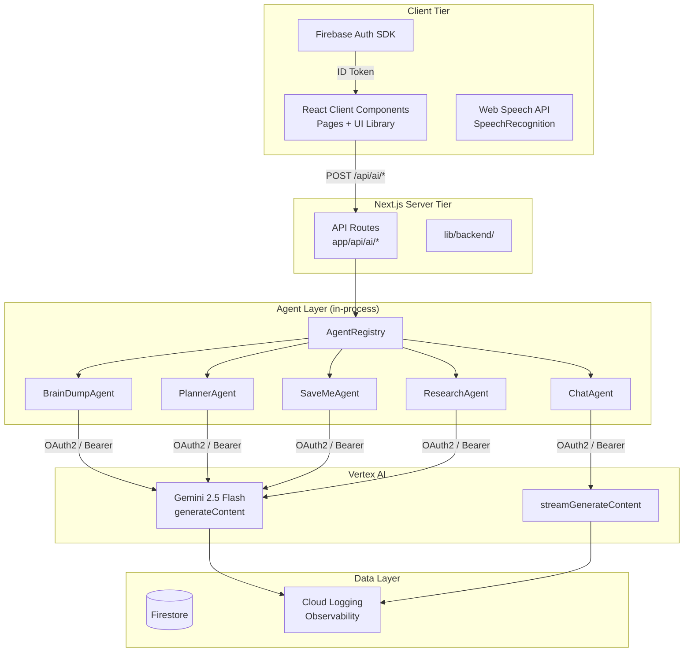
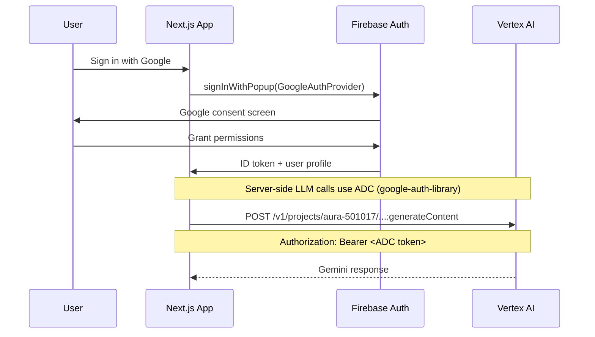

# AURA — Architecture Document

| Status | Version | Date |
|--------|---------|------|
| Live | 2.0 | 2026-07-01 |

---

## 1. System Architecture

AURA is a **Next.js 14+ App Router** application with an **integrated multi-agent AI backend** running on **Gemini 2.5 Flash via Vertex AI**. All agents run in-process within a single Next.js server, communicating through an agent registry pattern.

| Tier | Components | Runtime |
|------|-----------|---------|
| **Client** | Next.js SSR + React client components | Browser / Device |
| **Backend** | Next.js API routes (`/api/ai/*`) | Next.js server |
| **Agent Layer** | 5 agents (BrainDump, Chat, Planner, SaveMe, Research) via AgentRegistry | In-process |
| **AI & Data** | Vertex AI Gemini API, Firestore, Firebase Auth | Managed services |



### 1.1 Key Design Decisions

| Decision | Choice | Rationale |
|----------|--------|-----------|
| **AI Endpoint** | Vertex AI (aiplatform.googleapis.com) | Only `gemini-2.5-flash` available on project `aura-501017`; 2.0-flash, 1.5-pro return 404 |
| **Auth Method** | OAuth2/ADC (`google-auth-library`) | API key project not enabled for generativelanguage.googleapis.com |
| **Streaming** | `?alt=sse` on `streamGenerateContent` | Native SSE support, no SSE library needed |
| **Agent Pattern** | In-process AgentRegistry | No separate Cloud Run services; single server for MVP |
| **Caching** | SHA-256 hash → in-memory Map (30s TTL) | Deduplicates identical prompts within same session |
| **Observability** | Structured JSON to stdout | Cloud Logging parses structured logs automatically in prod |
| **Voice Input** | Browser `webkitSpeechRecognition` | Low latency, free, instant — transcript then sent to Gemini |
| **Output Format** | Structured JSON (Zod-validated) | Frontend renders structured data, never raw Gemini text |

---

## 2. Folder Structure

```
aura/
├── app/
│   ├── api/ai/
│   │   ├── brain-dump/route.ts    # POST → BrainDumpAgent
│   │   ├── chat/route.ts          # POST (SSE) → ChatAgent
│   │   ├── save-me/route.ts       # POST → SaveMeAgent
│   │   ├── planner/route.ts       # POST → PlannerAgent
│   │   └── research/route.ts      # POST → ResearchAgent
│   ├── auth/page.tsx              # Firebase Auth page
│   ├── brain-dump/page.tsx        # Brain dump UI
│   ├── calendar/page.tsx          # Calendar view
│   ├── focus-session/page.tsx     # Pomodoro timer
│   ├── notifications/page.tsx     # Notification list
│   ├── onboarding/page.tsx        # First-time setup
│   ├── profile/page.tsx           # User profile
│   ├── save-me/page.tsx           # Save Me emergency
│   ├── schedule/page.tsx          # Day schedule
│   ├── settings/page.tsx          # Preferences
│   ├── tasks/page.tsx             # Task list
│   ├── timeline/page.tsx          # Life timeline
│   ├── weekly-report/page.tsx     # Weekly digest
│   ├── layout.tsx                 # Root layout
│   ├── page.tsx                   # Dashboard
│   └── globals.css                # Tailwind + styles
│
├── components/ui/
│   ├── bottom-tabs.tsx            # Bottom navigation
│   ├── glass-card.tsx             # Glass morphism card
│   ├── google-gemini-effect.tsx   # Animated background
│   ├── probability-bar.tsx        # Progress bar
│   ├── switch.tsx                 # Radix switch
│   ├── task-card.tsx              # Task display card
│   └── top-app-bar.tsx            # Top navigation bar
│
├── lib/
│   ├── backend/
│   │   ├── types.ts               # Zod schemas + interfaces
│   │   ├── llm-service.ts         # Vertex AI wrapper (singleton)
│   │   ├── observability.ts       # Structured logging
│   │   ├── agent.ts               # BaseAgent abstract class
│   │   ├── agent-registry.ts      # Central agent registry
│   │   ├── agent-runtime.ts       # Agent execution + routing
│   │   ├── intent-classifier.ts   # Gemini-based intent routing
│   │   ├── load-prompts.ts        # File-based prompt loader
│   │   ├── agents/
│   │   │   ├── index.ts           # registerAllAgents()
│   │   │   ├── brain-dump-agent.ts
│   │   │   ├── chat-agent.ts
│   │   │   ├── planner-agent.ts
│   │   │   ├── save-me-agent.ts
│   │   │   └── research-agent.ts
│   │   └── prompts/
│   │       ├── brain-dump/
│   │       │   ├── brain-dump.system.md
│   │       │   ├── brain-dump.examples.md
│   │       │   └── brain-dump.schema.json
│   │       ├── chat/
│   │       ├── planner/
│   │       ├── save-me/
│   │       ├── research/
│   │       └── reflection/
│   ├── firebase.ts               # Firebase client init
│   ├── mock-data.ts              # Deprecated — to be removed
│   └── utils.ts                  # cn() + helpers
│
├── types/
│   └── index.ts                  # Shared TS types
│
├── docs/
│   ├── ARCHITECTURE.md           # This document
│   └── PRD.md                    # Product requirements
│
├── .env.local                    # Firebase config + GEMINI_API_KEY
├── tailwind.config.js            # Tailwind + custom colors
├── next.config.js
├── package.json
└── tsconfig.json
```

---

## 3. API Endpoints

### 3.1 AI API Routes (`/api/ai/*`)

All routes accept `POST` with `{ userMessage: string, userId?: string }`.

| Route | Agent | Response | Notes |
|-------|-------|----------|-------|
| `/api/ai/brain-dump` | BrainDumpAgent | `{ tasks: [], events: [], notes: [] }` | Structured extraction |
| `/api/ai/chat` | ChatAgent | SSE stream of `{"text":"...","done":false}\n` | Streaming via `streamGenerateContent` |
| `/api/ai/save-me` | SaveMeAgent | `{ overloaded, workloadScore, suggestedActions, priorityAdjustments? }` | Accepts `taskData` or `userMessage` |
| `/api/ai/planner` | PlannerAgent | `{ plan: [{ time, title, duration, type }], reasoning? }` | Accepts `tasks` array or `userMessage` |
| `/api/ai/research` | ResearchAgent | `{ summary, keyFindings, sources? }` | Structured briefs |

### 3.2 Client Routes

| Path | Page | Description |
|------|------|-------------|
| `/` | Dashboard | Overview with agent status, schedule, tasks |
| `/auth` | Auth | Firebase Google sign-in |
| `/onboarding` | Onboarding | First-time setup flow |
| `/brain-dump` | Brain Dump | Voice/text input → Gemini → structured output |
| `/calendar` | Calendar | Month view with events (client-side navigation) |
| `/focus-session` | Focus Session | Pomodoro timer with phase cycling |
| `/notifications` | Notifications | Alert list |
| `/profile` | Profile | User settings, sign out |
| `/save-me` | Save Me | Emergency workload analysis |
| `/schedule` | Schedule | Day schedule view |
| `/settings` | Settings | Preferences, AI personality |
| `/tasks` | Tasks | Filterable task list |
| `/timeline` | Timeline | Life goals and milestones |
| `/weekly-report` | Weekly Report | Productivity digest |

---

## 4. Agent System

### 4.1 Architecture

```
User Input → API Route → AgentRegistry.get(id) → BaseAgent.process() → LLMService.generate()
                                                                          ↓
                                                                   Vertex AI Gemini
                                                                          ↓
                                                                   Zod-validated JSON
                                                                          ↓
                                                                  Response to client
```

### 4.2 Agent Registry

All agents register once on server start via `registerAllAgents()` (idempotent). Routes get agents by ID:

```typescript
agentRegistry.get('brain-dump')  // → BrainDumpAgent instance
```

### 4.3 Intent Classification

When no agent ID is specified, `IntentClassifier` uses Gemini to classify user intent against registered agent descriptions:

```typescript
// Returns agent ID like "planner", "chat", etc.
const agentId = await classifyIntent(userMessage);
```

### 4.4 Prompt Files

Each agent has three files in `lib/backend/prompts/{agentId}/`:

| File | Purpose |
|------|---------|
| `{agentId}.system.md` | System prompt with rules and constraints |
| `{agentId}.examples.md` | Few-shot examples (User:/Assistant: pairs) |
| `{agentId}.schema.json` | JSON Schema for structured output |

---

## 5. LLMService Design

### 5.1 Request Flow

```
GenerationRequest
  ├── systemPrompt    → prepended as "System: ..."
  ├── userMessage     → main user input
  ├── examples[]      → inserted as role: content pairs
  ├── schema?         → appended as "Respond with JSON matching: ..."
  └── temperature     → default 0.7

  ↓

1. Build request body
2. Hash (SHA-256) → check cache (30s TTL)
3. Get OAuth2 token via google-auth-library
4. POST to Vertex AI :generateContent or :streamGenerateContent
5. Parse response (JSON if schema provided)
6. Cache result
7. Log observability (latency, tokens, success/error)
```

### 5.2 Caching

- **Key**: SHA-256 of the full request body (first 16 chars)
- **TTL**: 30 seconds
- **Max entries**: 200 (LRU eviction)
- **Purpose**: Deduplicate identical or near-identical prompts within a session

### 5.3 Observability

Each LLM call logs a structured JSON object to stdout:

```typescript
{
  userId?: string,
  agentId: string,
  promptHash: string,
  promptTokens: number,
  completionTokens: number,
  latencyMs: number,
  model: "gemini-2.5-flash",
  success: boolean,
  error?: string,
  timestamp: string,
  severity: "INFO" | "ERROR"
}
```

In production, Cloud Logging automatically ingests structured `stdout` logs.

---

## 6. Authentication Flow



- **Client auth**: Firebase Auth with Google provider (popup flow)
- **Server auth**: Application Default Credentials via `google-auth-library` (ADC)
- **Local dev**: `gcloud auth application-default login` provides ADC token

---

## 7. Data Layer

### 7.1 Firestore

Firestore is initialized but currently **not actively read** — all data comes from mock sources. Integration planned for next phase.

Collections schema (planned):
- `users/{userId}` — Profile, preferences
- `users/{userId}/tasks` — Tasks with priorities, status, deadlines
- `users/{userId}/schedule` — Daily schedule slots
- `users/{userId}/focusSessions` — Pomodoro session history
- `users/{userId}/weeklyReports` — Generated reports

### 7.2 Caching (LLMService)

- In-memory Map with 30s TTL
- SHA-256 prompt hash as key
- Max 200 entries, LRU eviction

---

## 8. Agent Prompts

Each agent prompt set follows this structure:

```
System prompt:
  - Role definition (e.g., "You are AURA's Brain Dump processor")
  - Extraction rules
  - Tone guidelines
  - Constraints

Examples (few-shot):
  - User: "natural language input"
  - Assistant: {"structured": "json output"}

Schema (JSON Schema):
  - Defines exact output structure
  - Frontend renders based on schema
```

### 8.1 Prompt Locations

| Agent | System | Examples | Schema |
|-------|--------|----------|--------|
| BrainDump | `prompts/brain-dump/brain-dump.system.md` | `brain-dump.examples.md` | `brain-dump.schema.json` |
| Chat | `prompts/chat/chat.system.md` | `chat.examples.md` | `chat.schema.json` |
| Planner | `prompts/planner/planner.system.md` | `planner.examples.md` | `planner.schema.json` |
| SaveMe | `prompts/save-me/save-me.system.md` | `save-me.examples.md` | `save-me.schema.json` |
| Research | `prompts/research/research.system.md` | `research.examples.md` | `research.schema.json` |
| Reflection | `prompts/reflection/reflection.system.md` | — | `reflection.schema.json` |

---

## 9. Known Limitations

| Issue | Impact | Resolution |
|-------|--------|------------|
| **No Firestore reads** | All data is mock | Wire Repository pattern |
| **Voice only on Chrome** | `webkitSpeechRecognition` is non-standard | Add fallback / use Gemini STT |
| **No auth on API routes** | Routes are public | Add Firebase Admin SDK token verification |
| **No context/memory** | Each call is stateless | Integrate MemoryAgent |
| **No rate limiting** | Abuse possible | Add rate limiter middleware |
| **ADC in dev** | Requires `gcloud auth` | Document setup steps |

---

## 10. Environment Variables

| Variable | Source | Purpose |
|----------|--------|---------|
| `NEXT_PUBLIC_FIREBASE_API_KEY` | Firebase project | Client-side Firebase init |
| `NEXT_PUBLIC_FIREBASE_AUTH_DOMAIN` | Firebase project | Auth domain |
| `NEXT_PUBLIC_FIREBASE_PROJECT_ID` | Firebase project | `aura-501017` |
| `NEXT_PUBLIC_FIREBASE_STORAGE_BUCKET` | Firebase project | Storage bucket |
| `NEXT_PUBLIC_FIREBASE_MESSAGING_SENDER_ID` | Firebase project | FCM sender |
| `NEXT_PUBLIC_FIREBASE_APP_ID` | Firebase project | App identifier |
| `GEMINI_API_KEY` | Google AI Studio | Fallback (not used — OAuth2 preferred) |

*End of Architecture Document*
