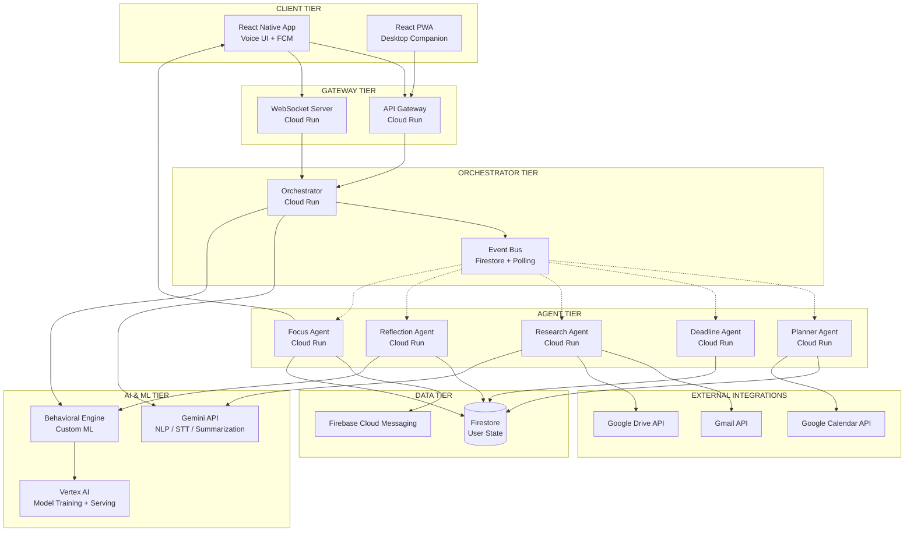
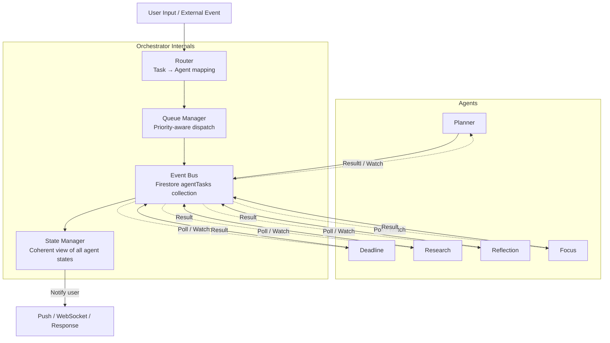
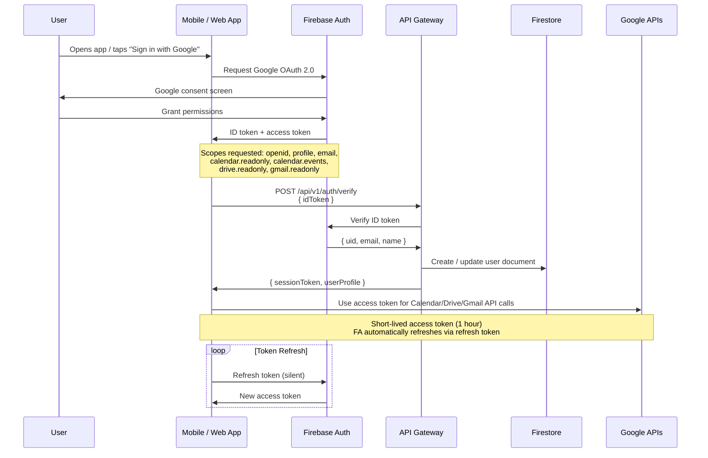
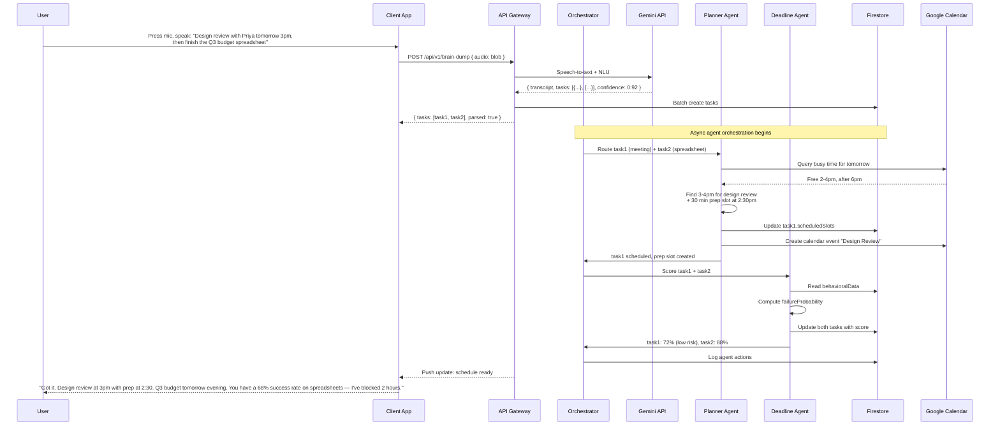
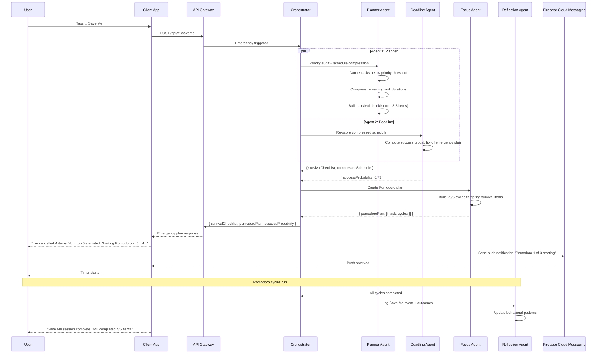
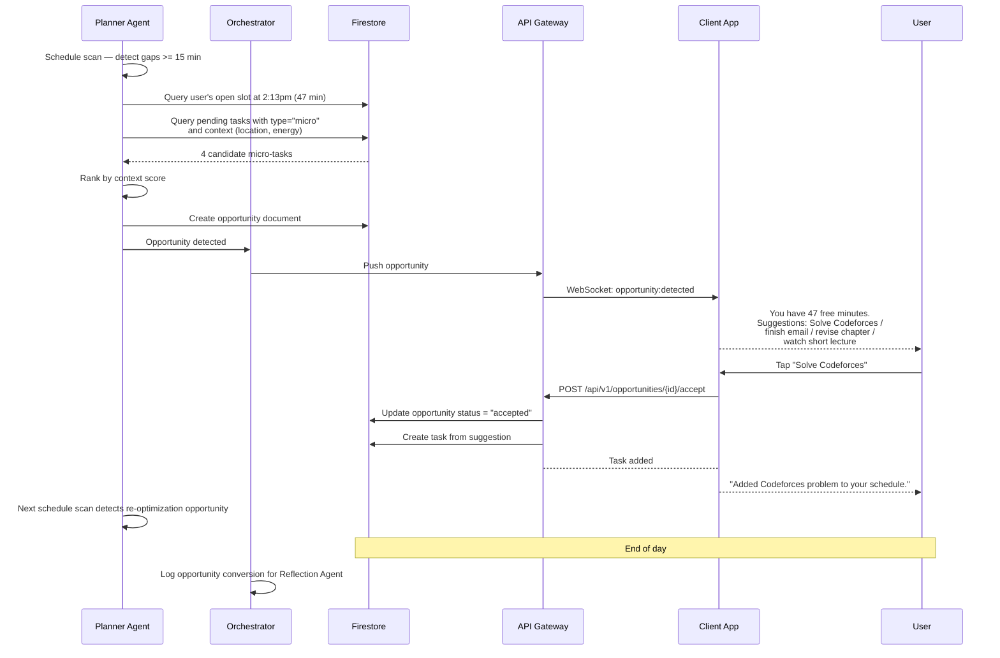
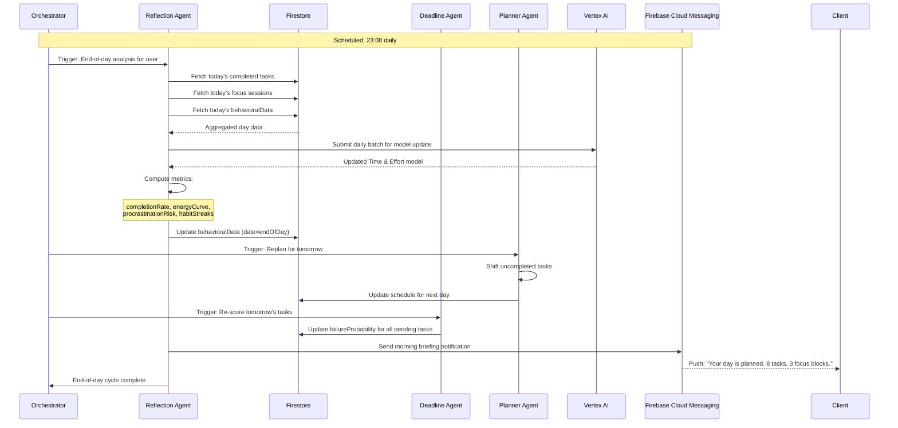
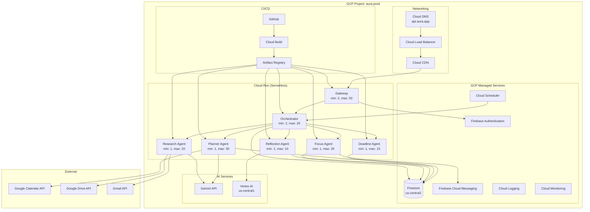

# AURA — Architecture Document

| Status | Version | Date |
|--------|---------|------|
| Draft | 1.0 | 2026-06-30 |

---

## Table of Contents

1. [System Architecture](#1-system-architecture)
2. [Folder Structure](#2-folder-structure)
3. [API Endpoints](#3-api-endpoints)
4. [Firestore Schema](#4-firestore-schema)
5. [Agent Orchestration Flow](#5-agent-orchestration-flow)
6. [Authentication Flow](#6-authentication-flow)
7. [Google Integrations](#7-google-integrations)
8. [Sequence Diagrams](#8-sequence-diagrams)
9. [Deployment Architecture on Cloud Run](#9-deployment-architecture-on-cloud-run)

---

## 1. System Architecture

AURA follows a **serverless, event-driven, multi-agent architecture** on Google Cloud Platform. The system is split into four tiers:

| Tier | Components | Runtime |
|------|-----------|---------|
| **Client** | React Native mobile app, React/PWA web app | Device |
| **Gateway & Orchestrator** | API Gateway, WebSocket Server, Orchestrator Service | Cloud Run |
| **Agent Layer** | 5 isolated agent services (Planner, Deadline, Research, Reflection, Focus) | Cloud Run |
| **AI & Data** | Gemini API, Vertex AI, Firestore, Firebase Auth, FCM | Managed services |



### 1.1 Communication Patterns

| Pattern | Mechanism | Use Case |
|---------|-----------|----------|
| **Synchronous (REST)** | HTTP / JSON via API Gateway | Brain Dump submission, Save Me trigger, CRUD operations |
| **Asynchronous (Event Bus)** | Firestore document subscriptions | Agent-to-agent communication, state changes |
| **Real-time** | WebSocket | Live schedule updates, Focus Agent timer sync, Opportunity Detection push |
| **Push** | Firebase Cloud Messaging | Daily briefings, proactive alerts, Weekly Report delivery |
| **Server-sent** | Gemini API streaming | Real-time voice transcription, natural language response generation |

---

## 2. Folder Structure

```
aura/
├── .github/
│   └── workflows/
│       ├── deploy-agent.yml          # Cloud Run deploy for all agents
│       ├── deploy-gateway.yml        # Cloud Run deploy for gateway
│       ├── deploy-orchestrator.yml   # Cloud Run deploy for orchestrator
│       ├── lint.yml                  # ESLint + Prettier
│       └── test.yml                  # Unit + integration tests
│
├── clients/
│   ├── mobile/                       # React Native (iOS + Android)
│   │   ├── src/
│   │   │   ├── components/           # Reusable UI components
│   │   │   ├── screens/              # Screen-level views
│   │   │   ├── hooks/                # Custom React hooks
│   │   │   ├── services/             # API client + auth + FCM
│   │   │   ├── audio/                # Voice capture + streaming
│   │   │   ├── store/                # State management
│   │   │   └── types/                # TypeScript types
│   │   ├── android/
│   │   └── ios/
│   │
│   └── web/                          # React PWA
│       ├── src/
│       │   ├── components/
│       │   ├── screens/
│       │   ├── hooks/
│       │   ├── services/
│       │   └── types/
│       └── public/
│
├── services/
│   ├── gateway/                      # API Gateway (Cloud Run)
│   │   ├── src/
│   │   │   ├── routes/               # HTTP route handlers
│   │   │   ├── middleware/           # Auth, rate-limit, validation
│   │   │   ├── ws/                   # WebSocket handlers
│   │   │   └── config/              # Service configuration
│   │   ├── Dockerfile
│   │   └── package.json
│   │
│   ├── orchestrator/                 # Agent orchestrator (Cloud Run)
│   │   ├── src/
│   │   │   ├── agents/               # Agent client definitions
│   │   │   ├── bus/                  # Event bus implementation
│   │   │   ├── router/               # Task-to-agent routing
│   │   │   └── config/
│   │   ├── Dockerfile
│   │   └── package.json
│   │
│   ├── agent-planner/                # Planner Agent (Cloud Run)
│   │   ├── src/
│   │   │   ├── scheduler/            # Schedule optimization engine
│   │   │   ├── calendar/             # Google Calendar client
│   │   │   ├── energy/               # Energy-aware scheduling logic
│   │   │   └── config/
│   │   ├── Dockerfile
│   │   └── package.json
│   │
│   ├── agent-deadline/               # Deadline Agent (Cloud Run)
│   │   ├── src/
│   │   │   ├── predictor/            # Failure probability models
│   │   │   ├── monitor/              # Deadline monitoring
│   │   │   ├── escalator/            # Risk escalation logic
│   │   │   └── config/
│   │   ├── Dockerfile
│   │   └── package.json
│   │
│   ├── agent-research/               # Research Agent (Cloud Run)
│   │   ├── src/
│   │   │   ├── collector/            # Information gathering
│   │   │   ├── summarizer/           # Gemini-based summarization
│   │   │   ├── gmail/                # Gmail API client
│   │   │   ├── drive/                # Google Drive API client
│   │   │   └── config/
│   │   ├── Dockerfile
│   │   └── package.json
│   │
│   ├── agent-reflection/             # Reflection Agent (Cloud Run)
│   │   ├── src/
│   │   │   ├── analyzer/             # Behavioral analysis engine
│   │   │   ├── reporter/             # Weekly Report generator
│   │   │   ├── memory/               # Persistent memory manager
│   │   │   └── config/
│   │   ├── Dockerfile
│   │   └── package.json
│   │
│   └── agent-focus/                  # Focus Agent (Cloud Run)
│       ├── src/
│       │   ├── pomodoro/             # Pomodoro cycle manager
│       │   ├── blocker/              # Notification suppression
│       │   ├── saveme/               # Save Me emergency handler
│       │   └── config/
│       ├── Dockerfile
│       └── package.json
│
├── shared/
│   ├── types/                        # TypeScript type definitions
│   │   ├── task.ts
│   │   ├── schedule.ts
│   │   ├── agent.ts
│   │   ├── user.ts
│   │   └── events.ts
│   ├── validation/                   # Zod schemas shared across services
│   └── constants/                    # Shared constants and enums
│
├── infrastructure/
│   ├── terraform/
│   │   ├── main.tf                   # GCP project setup
│   │   ├── firestore.tf              # Firestore indexes + security rules
│   │   ├── cloud-run.tf              # Cloud Run service definitions
│   │   ├── iam.tf                    # Service accounts + permissions
│   │   ├── fcm.tf                    # Firebase Cloud Messaging config
│   │   └── variables.tf
│   └── docker/
│       ├── base.Dockerfile           # Shared base image
│       └── cloudbuild.yaml           # Cloud Build CI/CD
│
├── docs/
│   ├── PRD.md                        # Product Requirements Document
│   └── ARCHITECTURE.md               # This document
│
├── .eslintrc.js
├── .prettierrc
├── tsconfig.base.json
├── package.json                      # Workspace root
└── README.md
```

---

## 3. API Endpoints

All HTTP endpoints are served by the **API Gateway** service on Cloud Run and prefixed with `/api/v1`. WebSocket connections use path `/ws`.

### 3.1 Task Management

| Method | Path | Description | Request Body | Response |
|--------|------|-------------|--------------|----------|
| `POST` | `/api/v1/tasks` | Create a task (from Brain Dump or manual) | `{ content, priority?, deadline?, type?, location? }` | `{ task }` |
| `GET` | `/api/v1/tasks` | List tasks (filterable) | Query: `?status=pending&date=2026-06-30` | `{ tasks[], total, page }` |
| `GET` | `/api/v1/tasks/:id` | Get task detail | — | `{ task, failureProbability }` |
| `PATCH` | `/api/v1/tasks/:id` | Update task | `{ status, priority, ... }` | `{ task }` |
| `DELETE` | `/api/v1/tasks/:id` | Delete task | — | `{ ok: true }` |
| `POST` | `/api/v1/tasks/:id/complete` | Mark task complete | — | `{ task, replanTriggered }` |

### 3.2 Brain Dump

| Method | Path | Description | Request Body | Response |
|--------|------|-------------|--------------|----------|
| `POST` | `/api/v1/brain-dump` | Submit voice or text input | `{ text?, audioUrl?, format: "voice"\|"text" }` | `{ tasks[], intent, confidence }` |
| `POST` | `/api/v1/brain-dump/stream` | Streaming voice input (WebSocket upgrade) | Binary audio chunks | `{ interimResults[], finalResult }` |
| `GET` | `/api/v1/brain-dump/history` | Past brain dump sessions | Query: `?limit=20` | `{ sessions[] }` |

### 3.3 Schedule

| Method | Path | Description | Request Body | Response |
|--------|------|-------------|--------------|----------|
| `GET` | `/api/v1/schedule` | Get current day/week schedule | Query: `?start=&end=` | `{ slots[], conflicts[] }` |
| `POST` | `/api/v1/schedule/replan` | Trigger autonomous replanning | `{ reason?: string }` | `{ newSchedule, diff }` |
| `POST` | `/api/v1/schedule/optimize` | Request energy-aware optimization | — | `{ optimizedSchedule }` |
| `POST` | `/api/v1/schedule/focus-insert` | Insert focus session in next available gap | `{ duration: number }` | `{ slot }` |

### 3.4 Save Me

| Method | Path | Description | Request Body | Response |
|--------|------|-------------|--------------|----------|
| `POST` | `/api/v1/saveme` | Trigger Save Me emergency mode | `{ priorityThreshold?: number }` | `{ survivalChecklist[], pomodoroPlan, successProbability }` |
| `POST` | `/api/v1/saveme/cancel` | Exit Save Me mode | — | `{ restoredSchedule }` |

### 3.5 Opportunity Detection

| Method | Path | Description | Request Body | Response |
|--------|------|-------------|--------------|----------|
| `GET` | `/api/v1/opportunities` | Get detected opportunity slots | Query: `?date=` | `{ opportunities[] }` |
| `POST` | `/api/v1/opportunities/:id/accept` | Accept suggested micro-task | — | `{ task }` |
| `POST` | `/api/v1/opportunities/:id/dismiss` | Dismiss suggestion | — | `{ ok: true }` |

### 3.6 Life Timeline

| Method | Path | Description | Request Body | Response |
|--------|------|-------------|--------------|----------|
| `GET` | `/api/v1/timeline` | Get timeline data | Query: `?zoom=month&start=&end=` | `{ milestones[], goals[], achievements[] }` |
| `POST` | `/api/v1/timeline/goals` | Set a goal | `{ title, category, targetDate, parentGoalId? }` | `{ goal }` |
| `PATCH` | `/api/v1/timeline/goals/:id` | Update goal progress | `{ progress: 0-100 }` | `{ goal }` |

### 3.7 Weekly Report

| Method | Path | Description | Request Body | Response |
|--------|------|-------------|--------------|----------|
| `GET` | `/api/v1/reports/weekly` | Get latest weekly report | Query: `?week=2026-W27` | `{ report }` |
| `GET` | `/api/v1/reports/weekly/list` | List past reports | — | `{ reports[] }` |

### 3.8 User & Settings

| Method | Path | Description | Request Body | Response |
|--------|------|-------------|--------------|----------|
| `GET` | `/api/v1/user/profile` | Get user profile | — | `{ user }` |
| `PATCH` | `/api/v1/user/profile` | Update profile | `{ name?, timezone?, ... }` | `{ user }` |
| `GET` | `/api/v1/user/personality` | Get AI personality settings | — | `{ personality }` |
| `PATCH` | `/api/v1/user/personality` | Update personality traits | `{ directness, empathy, humour, challengeLevel }` | `{ personality }` |
| `GET` | `/api/v1/user/memory` | View persistent memory summary | — | `{ preferences, patterns }` |
| `DELETE` | `/api/v1/user/data` | Delete all user data (GDPR) | — | `{ ok: true }` |

### 3.9 Agent Health

| Method | Path | Description |
|--------|------|-------------|
| `GET` | `/health` | Liveness check |
| `GET` | `/api/v1/agents/status` | Agent health and last-active timestamps |

### 3.10 WebSocket Events (path: `/ws`)

| Event Direction | Event Name | Payload |
|----------------|-----------|---------|
| Client → Server | `brain-dump:audio` | Audio chunk (base64) |
| Server → Client | `brain-dump:interim` | `{ text, confidence }` |
| Server → Client | `brain-dump:final` | `{ tasks[], intent }` |
| Server → Client | `schedule:updated` | `{ diff }` |
| Server → Client | `focus:tick` | `{ phase, remaining }` |
| Server → Client | `focus:complete` | `{ sessionSummary }` |
| Server → Client | `opportunity:detected` | `{ slot, suggestions[] }` |
| Server → Client | `agent:status` | `{ agent, status, message? }` |

---

## 4. Firestore Schema

### 4.1 Collection: `users`

| Field | Type | Description |
|-------|------|-------------|
| `userId` | `string` | Firestore document ID (Firebase Auth UID) |
| `email` | `string` | User email |
| `displayName` | `string` | User display name |
| `timezone` | `string` | IANA timezone (e.g., `"America/New_York"`) |
| `createdAt` | `Timestamp` | Account creation |
| `updatedAt` | `Timestamp` | Last profile update |
| `onboardingComplete` | `boolean` | Whether initial setup is done |
| `lastActiveAt` | `Timestamp` | Last user interaction |

### 4.2 Collection: `users/{userId}/personality`

| Field | Type | Description |
|-------|------|-------------|
| `directness` | `number` | 0–100 scale |
| `empathy` | `number` | 0–100 scale |
| `humour` | `number` | 0–100 scale |
| `challengeLevel` | `number` | 0–100 scale, affects Devil's Advocate intensity |
| `customInstructions` | `string` | Free-form personality notes |

### 4.3 Collection: `users/{userId}/tasks`

| Field | Type | Description |
|-------|------|-------------|
| `taskId` | `string` | Auto-generated ID |
| `content` | `string` | Task description |
| `type` | `string` | `"coding"`, `"writing"`, `"meeting"`, `"creative"`, `"admin"`, `"habit"`, `"other"` |
| `priority` | `number` | 1 (critical) – 5 (low) |
| `status` | `string` | `"pending"`, `"in_progress"`, `"completed"`, `"cancelled"`, `"deferred"` |
| `deadline` | `Timestamp` | Optional due date |
| `estimatedMinutes` | `number` | AI estimate (learned) |
| `actualMinutes` | `number` | Filled on completion |
| `failureProbability` | `number` | 0.0–1.0, set by Deadline Agent |
| `energyRequired` | `string` | `"high"`, `"medium"`, `"low"` |
| `location` | `string` | `"home"`, `"office"`, `"gym"`, `"any"` |
| `source` | `string` | `"brain_dump"`, `"manual"`, `"recurring"`, `"opportunity"` |
| `parentGoalId` | `string` | Optional link to Life Timeline goal |
| `recurringRule` | `string` | Optional RRULE or smart-detected pattern |
| `createdAt` | `Timestamp` | Creation time |
| `completedAt` | `Timestamp` | Completion time |
| `scheduledSlots` | `array` | `[{ start, end, date }]` |

**Indexes:**
- `status` + `priority` + `deadline` (for Deadline Agent queries)
- `userId` + `status` + `scheduledSlots.date` (for daily schedule)
- `userId` + `type` + `createdAt` (for behavioural learning)

### 4.4 Collection: `users/{userId}/schedule`

| Field | Type | Description |
|-------|------|-------------|
| `date` | `Timestamp` | Date of this schedule |
| `slots` | `array` | `[{ start, end, taskId?, title, type, energyLevel, location, locked: boolean }]` |
| `totalEnergy` | `number` | Computed energy budget for the day |
| `compressed` | `boolean` | Whether Save Me compression is active |
| `version` | `number` | Monotonic revision for diff tracking |

### 4.5 Collection: `users/{userId}/focusSessions`

| Field | Type | Description |
|-------|------|-------------|
| `sessionId` | `string` | Auto-generated |
| `date` | `Timestamp` | Session date |
| `pomodorosCompleted` | `number` | Cycles completed |
| `totalMinutes` | `number` | Duration |
| `taskId` | `string` | Linked task (optional) |
| `interruptions` | `number` | Count of breaks/interruptions |
| `energyBefore` | `number` | Self-reported or inferred |
| `energyAfter` | `number` | Self-reported or inferred |
| `outcome` | `string` | `"completed"`, `"abandoned"`, `"interrupted"` |

### 4.6 Collection: `users/{userId}/behavioralData`

| Field | Type | Description |
|-------|------|-------------|
| `date` | `Timestamp` | Data date |
| `workSpeedByType` | `map` | `{ coding: 0.8, writing: 1.2, ... }` (speed relative to estimate) |
| `energyCurve` | `array` | `[{ hour: 8, energy: 0.9 }, { hour: 14, energy: 0.4 }, ...]` |
| `procrastinationRisk` | `number` | 0–1 score for the day |
| `distractionApps` | `array` | List of distracting app categories detected |
| `sleepHours` | `number` | Hours slept (from wearable or manual) |
| `completionRate` | `number` | Fraction of tasks completed |

### 4.7 Collection: `users/{userId}/weeklyReports`

| Field | Type | Description |
|-------|------|-------------|
| `reportId` | `string` | `"2026-W27"` format |
| `weekStart` | `Timestamp` | Monday 00:00 |
| `weekEnd` | `Timestamp` | Sunday 23:59 |
| `completedTasks` | `number` | Count |
| `skippedTasks` | `number` | Count |
| `totalFocusMinutes` | `number` | Sum |
| `habitStreaks` | `map` | `{ "exercise": 5, "reading": 12, ... }` |
| `energyPatterns` | `map` | Summary of peak energy windows |
| `failureTrends` | `array` | Tasks with high failure probability |
| `productivityScore` | `number` | 0–100 composite |
| `recommendations` | `array` | Text insights from Reflection Agent |
| `generatedAt` | `Timestamp` | When the report was created |
| `deliveredViaFcm` | `boolean` | Whether push was sent |

### 4.8 Collection: `users/{userId}/timeline`

| Field | Type | Description |
|-------|------|-------------|
| `eventId` | `string` | Auto-generated |
| `type` | `string` | `"goal"`, `"milestone"`, `"achievement"`, `"task_completed"` |
| `title` | `string` | Display title |
| `description` | `string` | Details |
| `date` | `Timestamp` | Event date |
| `targetDate` | `Timestamp` | For goals/milestones |
| `progress` | `number` | 0–100 for goals |
| `parentEventId` | `string` | For hierarchical goals |
| `level` | `string` | `"life"`, `"yearly"`, `"quarterly"`, `"weekly"` |

### 4.9 Collection: `users/{userId}/agentLogs`

| Field | Type | Description |
|-------|------|-------------|
| `logId` | `string` | Auto-generated |
| `agent` | `string` | `"planner"`, `"deadline"`, `"research"`, `"reflection"`, `"focus"`, `"orchestrator"` |
| `action` | `string` | Action taken |
| `details` | `map` | Structured context |
| `timestamp` | `Timestamp` | Event time |
| `triggeredBy` | `string` | Event or agent that caused this |

**TTL:** Documents in `agentLogs` expire after 90 days via Firestore TTL policy.

### 4.10 Collection: `users/{userId}/opportunities`

| Field | Type | Description |
|-------|------|-------------|
| `opportunityId` | `string` | Auto-generated |
| `slotStart` | `Timestamp` | Gap start |
| `slotEnd` | `Timestamp` | Gap end |
| `durationMinutes` | `number` | Gap length |
| `suggestions` | `array` | `[{ taskId, title, type, contextScore }]` |
| `status` | `string` | `"pending"`, `"accepted"`, `"dismissed"` |

### 4.11 Collection: `agentTasks` (cross-user, for orchestrator)

| Field | Type | Description |
|-------|------|-------------|
| `agentTaskId` | `string` | Auto-generated |
| `targetAgent` | `string` | Agent to execute |
| `sourceAgent` | `string` | Requesting agent |
| `userId` | `string` | Target user |
| `payload` | `map` | Task-specific data |
| `status` | `string` | `"queued"`, `"in_progress"`, `"completed"`, `"failed"` |
| `result` | `map` | Output data |
| `createdAt` | `Timestamp` | |
| `completedAt` | `Timestamp` | |

---

## 5. Agent Orchestration Flow

### 5.1 Orchestrator Responsibility

The **Orchestrator** is the central coordinator. It does not execute agent logic — it routes messages, manages state, and ensures agent isolation.



### 5.2 Task Routing Rules

| Incoming Event | Primary Agent | Supporting Agents |
|---------------|---------------|-------------------|
| Brain Dump (new task) | Planner | Deadline (scoring) |
| Task completed | Planner | Reflection (model update), Deadline (re-score) |
| Meeting approaching | Research | Planner (travel prep) |
| End of day | Reflection | Planner (tomorrow's plan) |
| Save Me triggered | Focus | Planner (replan), Deadline (re-score) |
| Free slot detected | Planner (Opportunity Detection) | — |
| Weekly report due | Reflection | Deadline (weekly stats) |
| Focus session started | Focus | — |

### 5.3 Event Bus Implementation

Agents communicate via the **`agentTasks`** Firestore collection. Each agent runs a long-lived Cloud Run instance that watches this collection using Firestore's `onSnapshot` listener filtered to `targetAgent`.

```
Agent Startup →
  Listen: agentTasks where targetAgent == self AND status == "queued"
  On new document:
    1. Claim: atomically update status → "in_progress"
    2. Execute: run agent logic
    3. Complete: write result, status → "completed"
    4. Trigger: orchestrator re-evaluates downstream tasks
```

This pattern provides:
- **At-least-once delivery** via Firestore transactions
- **Backpressure**: agents process one task at a time
- **Auditability**: full log of all agent task executions
- **Isolation**: no direct agent-to-agent calls

---

## 6. Authentication Flow



### 6.1 OAuth Scopes

| Scope | Purpose | Required |
|-------|---------|----------|
| `openid` | OpenID Connect identity | Yes |
| `profile` | User display name and photo | Yes |
| `email` | User email address | Yes |
| `https://www.googleapis.com/auth/calendar` | Calendar read/write | Yes |
| `https://www.googleapis.com/auth/calendar.events` | Create/modify events | Yes |
| `https://www.googleapis.com/auth/drive.readonly` | Read Drive documents | Yes |
| `https://www.googleapis.com/auth/gmail.readonly` | Read email threads | Yes |

### 6.2 Token Management

- **Access tokens** expire after 60 minutes. Firebase Auth SDK handles automatic refresh.
- **Refresh tokens** are managed by Google Identity Services; no server-side storage needed.
- **API Gateway middleware** validates session tokens on every request using Firebase Admin SDK.
- **Token revocation**: User can revoke OAuth scopes from Google Account settings at any time. AURA detects revocation on next API call and prompts re-authorization.

### 6.3 Authorization Middleware (API Gateway)

```
Request → Gateway
  → Extract Authorization header (Bearer token)
  → Firebase Admin SDK: verifyIdToken(token)
  → Extract uid from decoded token
  → Attach { uid, email } to request context
  → Forward to route handler
  → Route handler checks Firestore security rules (row-level)
```

---

## 7. Google Integrations

### 7.1 Integration Matrix

| Integration | Protocol | Auth Method | Scope | Data Flow |
|------------|----------|-------------|-------|-----------|
| **Gemini API** | REST / gRPC | API key (server-side) | — | Orchestrator sends NL input → Gemini returns structured tasks, summaries |
| **Vertex AI** | REST | Service account (server-side) | — | Reflection Agent sends training data → model endpoint returns predictions |
| **Firebase Auth** | SDK | Client SDK + Admin SDK server-side | OAuth 2.0 | User authenticates → Firebase returns ID token |
| **Firestore** | gRPC (SDK) | Firebase rules (client) + Admin SDK (server) | — | All agents read/write user state |
| **Cloud Run** | HTTP/gRPC | IAM service accounts | — | Each service listens on port 8080 |
| **Google Calendar API** | REST | OAuth 2.0 user access token | `calendar`, `calendar.events` | Planner reads busy time, creates/modifies events |
| **Google Drive API** | REST | OAuth 2.0 user access token | `drive.readonly` | Research Agent lists and reads files for meeting prep |
| **Gmail API** | REST | OAuth 2.0 user access token | `gmail.readonly` | Research Agent scans threads for upcoming meetings |
| **Firebase Cloud Messaging** | HTTP v1 API | Firebase Admin SDK (server-side) | — | Gateway/orchestrator sends push notifications to device |

### 7.2 Gemini API Usage

| Use Case | Model | Input | Output |
|----------|-------|-------|--------|
| Brain Dump parsing | `gemini-2.0-flash` | Raw voice transcript | Structured JSON: `{ tasks[], deadlines, priorities, context }` |
| Document summarization | `gemini-2.0-flash` | PDF/Doc content | 3-paragraph executive summary |
| Schedule reasoning | `gemini-2.0-pro` | Current schedule + task queue | Optimized schedule + rationale |
| Personality generation | `gemini-2.0-flash` | User query + personality profile | Personalized response text |
| Weekly report narrative | `gemini-2.0-pro` | Aggregated weekly data | Natural language report sections |

### 7.3 Vertex AI Usage

| Model | Purpose | Training Data | Retraining Cadence |
|-------|---------|--------------|-------------------|
| Time & Effort Estimator | Predict task duration | `behavioralData.workSpeedByType` | Daily incremental, weekly full |
| Failure Probability Classifier | Score task failure risk | `behavioralData.completionRate` + `tasks` features | Weekly full |
| Energy Curve Model | Predict energy by hour | `behavioralData.energyCurve` + sleep | Weekly full |
| Opportunity Ranker | Score micro-task suggestions | `opportunities` accepted/dismissed | Monthly |

### 7.4 OAuth Token Handling

```
User signs in → Firebase Auth handles OAuth 2.0 PKCE flow
  → Access + Refresh tokens stored by Firebase Auth SDK
  → API calls to Google Calendar/Drive/Gmail use user access token
  → Token refresh handled transparently by Firebase SDK
  
Server-side calls (Orchestrator → Google APIs):
  → Gateway receives user request with session token
  → Uses Firebase Admin SDK to generate a custom token
  → Or, clients forward Google access token to server for server-side API calls
  → Never store raw access tokens server-side (use Firebase Auth session)
```

---

## 8. Sequence Diagrams

### 8.1 Brain Dump → Task Creation → Scheduling



### 8.2 Save Me Emergency Mode



### 8.3 Opportunity Detection Flow



### 8.4 End-of-Day Reflection Cycle



### 8.5 Weekly Report Generation

```mermaid
sequenceDiagram
    participant O as Orchestrator
    participant RF as Reflection Agent
    participant D as Deadline Agent
    participant FS as Firestore
    participant GEM as Gemini API
    participant FCM as Firebase Cloud Messaging

    Note over O,FCM: Scheduled: Sunday 20:00 weekly

    O->>RF: Trigger: Generate Weekly Premium Report
    RF->>FS: Query tasks (last 7 days)
    RF->>FS: Query focusSessions (last 7 days)
    RF->>FS: Query behavioralData (last 7 days)
    FS-->>RF: Weekly aggregated data

    D->>FS: Query failureProbability trends
    FS-->>D: Weekly failure stats
    D->>RF: { highRiskTasks, trends }

    RF->>RF: Compute:
    Note over RF: - Completed vs skipped counts
    - Habit streaks
    - Energy window summary
    - Productivity score (0-100)

    RF->>GEM: Generate narrative sections
    GEM-->>RF: Natural language insights + recommendations

    RF->>FS: Write weeklyReports document
    RF->>FCM: Send push notification
    FCM-->>Client: "Your Weekly Report is ready"

    Client-->>User: In-app report card
```

---

## 9. Deployment Architecture on Cloud Run

### 9.1 Service Topology



### 9.2 Cloud Run Service Configuration

| Service | Min Instances | Max Instances | Memory | CPU | Concurrency | Startup CPU Boost | Timeout |
|---------|-------------|---------------|--------|-----|-------------|-------------------|---------|
| **Gateway** | 2 | 50 | 512 MB | 1 vCPU | 80 | Yes | 60 s |
| **Orchestrator** | 2 | 20 | 1 GB | 1 vCPU | 40 | Yes | 300 s |
| **Planner Agent** | 1 | 30 | 2 GB | 2 vCPU | 20 | Yes | 600 s |
| **Deadline Agent** | 1 | 15 | 1 GB | 1 vCPU | 30 | Yes | 120 s |
| **Research Agent** | 1 | 20 | 2 GB | 2 vCPU | 15 | Yes | 600 s |
| **Reflection Agent** | 1 | 10 | 2 GB | 2 vCPU | 10 | Yes | 900 s |
| **Focus Agent** | 1 | 25 | 512 MB | 1 vCPU | 50 | Yes | 300 s |

### 9.3 Cloud Run Service Accounts (IAM)

| Service Account | Roles | Used By |
|----------------|-------|---------|
| `aura-gateway-sa` | `roles/run.invoker`, `roles/firebase.authViewer` | Gateway |
| `aura-orchestrator-sa` | `roles/datastore.user`, `roles/run.invoker` | Orchestrator |
| `aura-planner-sa` | `roles/datastore.user` | Planner Agent |
| `aura-deadline-sa` | `roles/datastore.user`, `roles/aiplatform.user` | Deadline Agent |
| `aura-research-sa` | `roles/datastore.user` | Research Agent |
| `aura-reflection-sa` | `roles/datastore.user`, `roles/aiplatform.user` | Reflection Agent |
| `aura-focus-sa` | `roles/datastore.user`, `roles/fcm.notificationAdmin` | Focus Agent |

### 9.4 Firestore Security Rules

```
rules_version = '2';
service cloud.firestore {
  match /databases/{database}/documents {

    // User documents — only owner can read/write
    match /users/{userId} {
      allow read, write: if request.auth != null && request.auth.uid == userId;

      match /tasks/{taskId} {
        allow read, write: if request.auth != null && request.auth.uid == userId;
      }

      match /schedule/{date} {
        allow read, write: if request.auth != null && request.auth.uid == userId;
      }

      match /focusSessions/{sessionId} {
        allow read, write: if request.auth != null && request.auth.uid == userId;
      }

      match /behavioralData/{dataId} {
        allow read, write: if request.auth != null && request.auth.uid == userId;
      }

      match /weeklyReports/{reportId} {
        allow read: if request.auth != null && request.auth.uid == userId;
      }

      match /timeline/{eventId} {
        allow read, write: if request.auth != null && request.auth.uid == userId;
      }

      match /opportunities/{opportunityId} {
        allow read, write: if request.auth != null && request.auth.uid == userId;
      }

      match /personality/{p} {
        allow read, write: if request.auth != null && request.auth.uid == userId;
      }
    }

    // Agent communication bus — only agent service accounts can write
    match /agentTasks/{taskId} {
      allow read: if request.auth != null;
      allow write: if request.auth != null
        && request.auth.token.email in [
          'aura-orchestrator-sa@aura-prod.iam.gserviceaccount.com',
          'aura-planner-sa@aura-prod.iam.gserviceaccount.com',
          'aura-deadline-sa@aura-prod.iam.gserviceaccount.com',
          'aura-research-sa@aura-prod.iam.gserviceaccount.com',
          'aura-reflection-sa@aura-prod.iam.gserviceaccount.com',
          'aura-focus-sa@aura-prod.iam.gserviceaccount.com'
        ];
    }

    // Agent logs — agents write, users read
    match /users/{userId}/agentLogs/{logId} {
      allow read: if request.auth != null && request.auth.uid == userId;
      allow write: if request.auth != null;
    }
  }
}
```

### 9.5 CI/CD Pipeline

```
GitHub Push (main branch)
  └── Cloud Build Trigger
       ├── Lint & Type Check
       ├── Unit Tests
       ├── Build Docker Images
       ├── Push to Artifact Registry
       ├── Deploy to Cloud Run (all services)
       └── Smoke Test (health check on each service)
```

### 9.6 Environment Variables (per Cloud Run service)

Shared across all services:

| Variable | Source | Description |
|----------|--------|-------------|
| `FIRESTORE_DATABASE` | Terraform | Firestore database ID |
| `GEMINI_API_KEY` | Secret Manager | Gemini API key |
| `VERTEX_AI_LOCATION` | Terraform | `us-central1` |
| `FCM_PROJECT_ID` | Terraform | Firebase project ID |
| `LOG_LEVEL` | Terraform | `info` (production) |
| `NODE_ENV` | Terraform | `production` |

### 9.7 Cloud Scheduler Cron Jobs

| Job | Schedule | Target | Action |
|-----|----------|--------|--------|
| `end-of-day-cycle` | Daily, 23:00 user timezone | Orchestrator | Trigger daily reflection + replan |
| `weekly-report` | Weekly, Sunday 20:00 | Orchestrator | Trigger Weekly Premium Report generation |
| `model-retrain` | Weekly, Sunday 02:00 | Vertex AI | Trigger full model retraining pipeline |
| `data-cleanup` | Monthly, 1st 03:00 | Orchestrator | Purge expired agent logs (>90 days) |

### 9.8 Disaster Recovery

| Scenario | Mitigation |
|----------|-----------|
| **Cloud Run service crash** | Auto-restart by Cloud Run; min instances ensure warm standby |
| **Firestore region outage** | Multi-region Firestore (nam5) with automatic failover |
| **Gemini API rate limit** | Queue-based retry with exponential backoff via orchestrator |
| **OAuth token expiry** | Firebase Auth SDK automatic refresh; graceful degradation with re-auth prompt |
| **Agent deadlock** | Firestore transaction timeout (60s); orchestrator watchdog marks stale agentTasks as `failed` |
| **Data corruption** | Daily automated Firestore backups with 7-day retention |

---

*End of Architecture Document*
