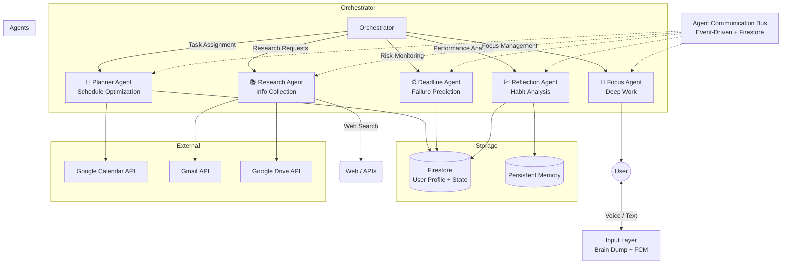
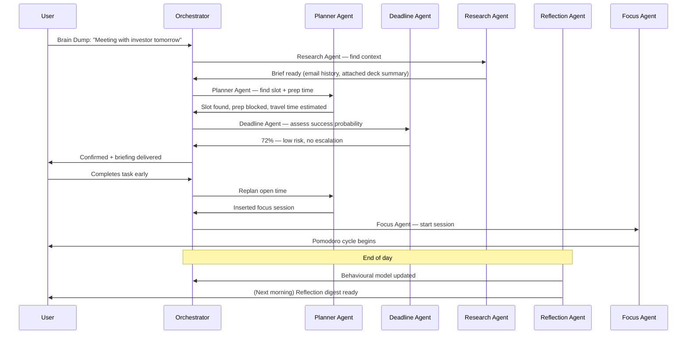
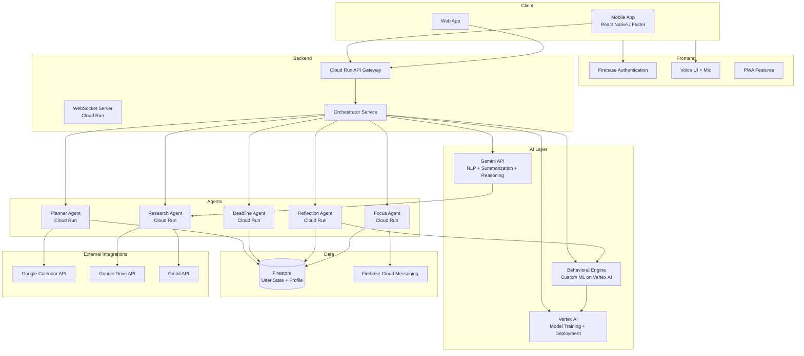

# AURA
## One Mind Ahead.

---

| Status | Version | Date |
|--------|---------|------|
| Draft | 1.0 | 2026-06-30 |

---

## 1. Executive Summary

AURA is an AI-powered executive assistant that redefines personal productivity through a multi-agent architecture. Unlike calendar apps or task managers that require constant manual input, AURA listens, learns, plans, and executes autonomously. Powered by Gemini API and Vertex AI, it ingests natural language via voice, builds a behavioral model from user activity, and orchestrates five specialized AI agents — Planner, Deadline, Research, Reflection, and Focus — to manage schedules, predict failure risks, research tasks, analyze habits, and maintain deep focus. AURA is the first consumer-grade executive assistant that acts *proactively*, not reactively.

---

## 2. Vision

To give every knowledge worker a tireless, personalised chief-of-staff that operates one mind ahead — anticipating needs, preventing failure, and creating time for what matters.

---

## 3. Problem Statement

Modern productivity tools are fragmented and passive:
- **Calendar apps** show *when* things are, not *what* to do about them.
- **Task managers** require manual entry, prioritisation, and rescheduling.
- **Reminder bots** nag without context or intelligence.
- **No existing tool** learns your energy rhythms, predicts task failure, autonomously replans missed work, or researches meeting topics in advance.

Knowledge workers waste 2–3 hours daily on scheduling, context-switching, and recovery from overcommitment. AURA closes this gap with autonomous, AI-driven executive function.

---

## 4. Product Goals

| # | Goal |
|---|------|
| G1 | Eliminate manual schedule management through autonomous planning and replanning. |
| G2 | Reduce task failure rates by predicting risk and intervening proactively. |
| G3 | Personalise every interaction through continuous behavioural learning and persistent memory. |
| G4 | Minimise user effort — voice-first input, asks only when necessary. |
| G5 | Keep users in flow with intelligent focus session management. |
| G6 | Provide deep, actionable insight through predictive analytics and weekly reporting. |

---

## 5. Target Users

- **Knowledge workers** with dynamic, unpredictable schedules.
- **Freelancers and solopreneurs** who manage their own time.
- **Students and researchers** balancing coursework, projects, and deadlines.
- **Executives and managers** who need high-level oversight without micromanagement.
- **ADHD and neurodivergent individuals** who benefit from external executive function support.

---

## 6. User Personas

### Priya — The Startup Founder
- Age: 32 | Role: CEO of a 15-person B2B SaaS
- Pain: Calendar chaos, context-switching between investor calls, product reviews, and hiring.
- Needs: Autonomous replanning when meetings overrun; research summaries before every call.
- AURA fit: Brain Dump Mode, Save Me button, Weekly Premium Report.

### Marcus — The PhD Candidate
- Age: 28 | Role: Computer Science researcher
- Pain: Struggles with deep work consistency; frequently underestimates task duration.
- Needs: Energy-aware scheduling, Focus Session Insertion, Failure Probability feedback.
- AURA fit: Time & Effort Estimation, Focus Agent, Reflection Agent.

### Elena — The Freelance Designer
- Age: 26 | Role: UI/UX freelancer
- Pain: Juggling multiple clients, missing micro-windows for small tasks.
- Needs: Opportunity Detection, smart recurring admin tasks, calendar sync.
- AURA fit: Opportunity Detection, Smart Recurring Tasks, Calendar Integration.

---

## 7. User Journey

### Onboarding
1. Download and authenticate via Firebase Authentication.
2. Grant calendar, drive, and mail permissions (Google Calendar API, Google Drive API, Gmail API).
3. First voice interaction: "Tell me about your week." AURA builds initial profile.
4. AURA scans existing calendar and email for context.

### Daily Loop
1. Morning: AURA surfaces the day's plan via proactive notification (Firebase Cloud Messaging).
2. Throughout day: User interacts via voice or text Brain Dump. Agents work in background.
3. Task completion or delay triggers autonomous replanning.
4. Focus sessions auto-inserted or user-initiated.
5. Evening: Reflection Agent analyses day and updates behavioural model.

### Weekly
- AURA delivers the Weekly Premium Report with productivity trends, habit analysis, and recommendations.

### Emergency
- User presses **Save Me** button. AURA compresses schedule, cancels low-priority items, and generates a Pomodoro survival plan.

---

## 8. Product Principles

1. **Proactive > Reactive.** AURA acts before the user asks.
2. **Voice-first, hands-free.** Natural language input is the primary interaction.
3. **Intelligent silence.** AURA asks only when it genuinely lacks information; otherwise it acts.
4. **Radical personalisation.** Every estimate, suggestion, and intervention is tuned to the individual.
5. **Privacy by design.** Behavioural data belongs to the user; agents operate on-device or in trusted cloud.
6. **Explainable AI.** Users can inspect *why* AURA made a given decision (e.g., failure probability breakdown).

---

## 9. Functional Requirements

### 9.1 Core Interaction & Input

| Feature ID | Feature Name | Description |
|-----------|--------------|-------------|
| F1 | **Brain Dump Mode (Voice Input)** | No forms to fill out. Just press the mic and speak your mind. The AI processes natural language seamlessly. |
| F2 | **Asks Only When Necessary** | Minimizes interruptions by making intelligent assumptions based on historical data. |
| F3 | **Persistent Memory** | Remembers past conversations, preferences, and context for a highly personalized experience. |

**Detailed Requirements:**
- F1-1: Voice capture via microphone with real-time speech-to-text via Gemini API.
- F1-2: Natural language understanding extracts tasks, deadlines, priorities, and context from unstructured speech.
- F1-3: Support for text-based input as fallback.
- F2-1: Confidence threshold system — AURA acts autonomously when confidence > 85%; asks for clarification otherwise.
- F2-2: Transparency log showing what assumptions were made and why.
- F3-1: Persistent user profile stored in Firestore, updated after every interaction.
- F3-2: Cross-session context retention — remembers preferences, recurring patterns, and past decisions.

### 9.2 Proactive Executive Assistance

| Feature ID | Feature Name | Description |
|-----------|--------------|-------------|
| F4 | **True "Executive" Capabilities** | Goes beyond standard reminders. Example: *"The meeting starts in 45 minutes. Traffic is heavy. Leave now. I've already summarized the attached PDF and prepared talking points."* |
| F5 | **Personalized & Customizable Personality** | Set the AI's tone, such as the "AI Devil's Advocate." Example: User: "I'll finish tomorrow." AI: "Historically, when you've said that, your completion rate was 18%. Get it done now." |

**Detailed Requirements:**
- F4-1: Context-aware alerts that combine calendar data, location, traffic, and document content.
- F4-2: Automatic document summarization via Gemini API for meeting preparation.
- F4-3: Proactive departure time recommendations based on real-time transit data.
- F5-1: Personality profile stored per-user with configurable traits: directness, empathy, humour, challenge level.
- F5-2: "Devil's Advocate" personality mode that surfaces historical counter-evidence when user makes optimistic commitments.
- F5-3: Personality can be adjusted at any time via voice or settings.

### 9.3 Autonomous Planning & Scheduling

| Feature ID | Feature Name | Description |
|-----------|--------------|-------------|
| F6 | **Automatic Schedule Rearrangement** | Dynamically adjusts your day based on real-time progress. |
| F7 | **Autonomous Replanning** | If you miss tasks today, the AI automatically replans and shifts everything for tomorrow. |
| F8 | **Energy-Aware Scheduling** | Assigns tasks based on your peak energy levels and daily rhythms. |
| F9 | **Context & Location Awareness** | Prioritizes tasks based on your current physical location (e.g., home, office, gym). |
| F10 | **Smart Recurring Tasks** | Intelligently manages habits and recurring duties without manual setup. |
| F11 | **Focus Session Insertion** | Automatically blocks out deep work sessions when it detects open schedule windows. |
| F12 | **Calendar Integration** | Deeply syncs with your existing calendar to find conflicts and open slots. |

**Detailed Requirements:**
- F6-1: Live schedule recalculation triggered by task completion, delay, or cancellation events.
- F6-2: Conflict resolution using priority scores and energy-level alignment.
- F7-1: End-of-day reconciliation — uncompleted tasks automatically migrated to next available slots.
- F7-2: Notification of replan with diff view so user can approve or override.
- F8-1: Energy model built from historical task performance across different times of day.
- F8-2: Peak cognitive tasks scheduled during high-energy windows; admin tasks during low-energy windows.
- F9-1: Integration with device location services for context detection.
- F9-2: Location-based task filtering — "home" tasks vs "office" tasks vs "errand" tasks.
- F10-1: Automatic detection of recurring patterns from user behaviour (e.g., "weekly review every Friday").
- F10-2: Smart skip logic — if the user completed the habit elsewhere, don't double-book.
- F11-1: Detection of gaps >= 90 minutes triggers automatic focus block insertion.
- F11-2: Focus blocks lock the calendar and suppress non-critical notifications.
- F12-1: Bidirectional sync with Google Calendar API.
- F12-2: Conflict detection across multiple calendars.
- F12-3: Event creation, modification, and cancellation on the user's behalf.

### 9.4 Predictive Analytics & Deep Learning

| Feature ID | Feature Name | Description |
|-----------|--------------|-------------|
| F13 | **Time & Effort Estimation** | Accurately estimates actual task effort by learning from your past work speeds. |
| F14 | **Failure Probability & Chess Engine Evaluation** | Every task gets a "Success Probability" score (similar to a chess engine evaluation bar), predicting the likelihood of failure based on past behavior. |
| F15 | **Continuous Behavioral Learning** | Actively learns from your procrastination times, usage of distraction apps, sleep schedule, and work speed. |

**Detailed Requirements:**
- F13-1: Regression model trained on historical task completion time vs estimated time.
- F13-2: Per-task-type calibration (coding, writing, meetings, creative work each have separate models).
- F14-1: Failure Probability score (0–100%) displayed per task with visual "evaluation bar" UI.
- F14-2: Score factors: historical completion rate for similar tasks, current energy level, time of day, procrastination risk.
- F14-3: Intervention triggers — if probability drops below 40%, AURA escalates with deadline agent alerts.
- F15-1: Data pipelining from device usage patterns (screen time, app categories, sleep data via wearables).
- F15-2: Model retraining on a cadence (daily incremental, weekly full) using Vertex AI.
- F15-3: Privacy controls — user can pause data collection or delete behavioural history.

### 9.5 Specialized Tools & Modes

| Feature ID | Feature Name | Description |
|-----------|--------------|-------------|
| F16 | **🚨 'Save Me' Button** | A panic button for when you are completely overwhelmed. Cancels low-priority work. Compresses the schedule. Generates an actionable survival checklist. Estimates success chances. Creates an immediate Pomodoro plan to catch up. |
| F17 | **Opportunity Detection** | Notices small windows of free time and suggests micro-tasks. Example: "You have 47 free minutes. Suggestions: Solve one Codeforces problem, finish a pending email, revise a chapter, or watch a short lecture." |
| F18 | **Life Timeline** | A visual, interactive timeline of your goals, past achievements, and future milestones. |
| F19 | **Weekly Premium Report** | A high-level, beautifully formatted weekly digest of your productivity, habits, and areas for improvement. |

**Detailed Requirements:**
- F16-1: One-tap or voice-activated emergency mode.
- F16-2: Automatic priority audit — deprioritises or cancels items below a configurable priority threshold.
- F16-3: Schedule compression algorithm that tightens estimated durations without breaking commitments.
- F16-4: Survival checklist generation with the top 3–5 most critical items.
- F16-5: Instant Pomodoro plan with 25/5 cycles targeting the survival list.
- F16-6: Post-emergency debrief — success probability of the compressed plan.
- F17-1: Gap detection with configurable minimum threshold (default: 15 min).
- F17-2: Micro-task suggestions ranked by context (location, energy, time-of-day).
- F17-3: One-tap acceptance to add the suggested task.
- F18-1: Horizontal timeline view with zoom (day / week / month / year / lifetime).
- F18-2: Achievements marked with completion data; future milestones with probability estimates.
- F18-3: Goals hierarchy — life goals → yearly goals → quarterly OKRs → weekly tasks.
- F19-1: Auto-generated every Monday morning for the prior week.
- F19-2: Sections: completed tasks, skipped tasks, habit streaks, energy patterns, failure probability trends.
- F19-3: PDF or in-app rendered delivery via Firebase Cloud Messaging notification.

---

## 10. Multi-Agent Architecture

AURA operates five specialized AI agents, each with a distinct role, communicating through a shared state layer.



### 10.1 Planner Agent
- **Role:** Creates and optimizes the user's schedule.
- **Capabilities:**
  - Generates daily/weekly plans from tasks, calendar events, and energy model.
  - Executes Automatic Schedule Rearrangement and Autonomous Replanning.
  - Performs Energy-Aware Scheduling and Focus Session Insertion.
  - Integrates with Google Calendar API for live calendar sync.
- **Triggers:** New task arrival, task completion, end-of-day reconciliation, calendar change webhook.

### 10.2 Deadline Agent
- **Role:** Predicts failure rates, calculates probabilities, and monitors approaching deadlines.
- **Capabilities:**
  - Assigns Failure Probability scores to every task (Chess Engine Evaluation bar).
  - Monitors deadline proximity and escalates when risk exceeds threshold.
  - Recommends priority adjustments to the Planner Agent.
- **Triggers:** Task creation, task status change, periodic (every hour for near-deadline tasks).

### 10.3 Research Agent
- **Role:** Automatically finds, collects, and summarizes relevant information for upcoming tasks and meetings.
- **Capabilities:**
  - Scans Gmail API and Google Drive API for meeting-related documents.
  - Generates concise pre-meeting briefs via Gemini API.
  - Discovers relevant background material for tasks.
  - Supplies context to Planner and Focus agents.
- **Triggers:** Upcoming meeting (N minutes before), new task with research requirement.

### 10.4 Reflection Agent
- **Role:** Analyzes habits, sleep, and performance data to improve future estimates.
- **Capabilities:**
  - Builds and maintains the behavioural model (procrastination patterns, work speed, energy curves).
  - Refines Time & Effort Estimation models.
  - Detects habit regressions and streaks.
  - Generates the Weekly Premium Report.
  - Updates the Persistent Memory store.
- **Triggers:** End of day, end of week, data collection pipeline completion.

### 10.5 Focus Agent
- **Role:** Actively keeps the user on track during deep work and Pomodoro sessions.
- **Capabilities:**
  - Manages Pomodoro cycles (25 min focus / 5 min break).
  - Suppresses distracting notifications during focus blocks.
  - Reports focus session outcomes back to Reflection Agent.
  - Handles the **Save Me** emergency Pomodoro plan.
- **Triggers:** Focus session start, Save Me activation, break timer completion.

### Agent Interaction Flow



---

## 11. User Flows

### 11.1 Daily Schedule Flow

```mermaid
flowchart TD
    A[User wakes up] --> B[AURA sends morning briefing<br/>via FCM notification]
    B --> C{User responds?}
    C -->|Yes - Voice| D[Brain Dump Mode<br/>"Feeling low energy today"]
    C -->|Yes - Text| E[Text input]
    C -->|No| F[Proceed with existing plan]
    D --> G[Planner re-optimises<br/>(energy-adjusted)]
    E --> G
    F --> H{Task execution loop}
    G --> H
    H --> I[User starts task]
    I --> J{Deadline Agent<br/>risk > threshold?}
    J -->|Yes| K[Proactive alert + suggestion]
    J -->|No| L[Continue normally]
    K --> L
    L --> M[Task completed / delayed]
    M --> N[Planner Agent<br/>rearranges if needed]
    N --> O{More tasks?}
    O -->|Yes| H
    O -->|No| P[End of day]
    P --> Q[Reflection Agent<br/>updates model]
    Q --> R[AURA generates<br/>plan for tomorrow]
    R --> S[Goodnight]
```

### 11.2 Save Me Emergency Flow

```mermaid
flowchart TD
    A[User feeling overwhelmed] --> B[Triggers 🚨 Save Me]
    B --> C[Planner Agent cancels<br/>low-priority tasks]
    C --> D[Schedule compression]
    D --> E[Survival checklist generated<br/>(top 3-5 items)]
    E --> F[Failure probability estimated<br/>for compressed plan]
    F --> G[Pomodoro plan created]
    G --> H[Focus Agent begins<br/>first Pomodoro cycle]
    H --> I[Save Me mode active]
    I --> J[User completes survival items]
    J --> K[Post-emergency debrief]
    K --> L[Reflection Agent<br/>logs patterns]
```

### 11.3 Opportunity Detection Flow

```mermaid
flowchart TD
    A[Planner detects<br/>47 min free slot] --> B[Opportunity Detection<br/>analyses context]
    B --> C[Checks: location, energy,<br/>time of day, pending tasks]
    C --> D[Suggests micro-tasks:<br/>"Solve Codeforces / finish email /<br/>revise chapter / watch lecture"]
    D --> E{User accepts?}
    E -->|Yes| F[Micro-task added to schedule]
    E -->|No| G[Slot remains free]
    F --> H[Tracked by Deadline Agent]
    H --> I[Reflection Agent logs<br/>conversion rate]
```

---

## 12. Technical Architecture



### 12.1 Component Breakdown

| Component | Technology | Purpose |
|-----------|-----------|---------|
| Mobile App | React Native | Cross-platform mobile client with voice integration |
| Web App | React / PWA | Desktop companion with same feature set |
| Authentication | Firebase Authentication | User login, session management, OAuth scopes |
| API Gateway | Cloud Run (Fastify/Express) | Request routing, WebSocket management, rate limiting |
| Orchestrator | Cloud Run | Agent task routing, state coordination, event bus |
| Each Agent | Cloud Run (isolated) | Independent, scalable agent instances |
| AI / NLP | Gemini API | Speech-to-text, summarization, reasoning, natural language understanding |
| ML Training | Vertex AI | Behavioural model training, failure probability models, energy curve fitting |
| Database | Firestore | Real-time user state, persistent memory, task storage |
| Push | Firebase Cloud Messaging | Proactive notifications, Save Me alerts, daily briefings |
| Calendar | Google Calendar API | Read/write calendar events, conflict detection |
| Drive | Google Drive API | Document access for Research Agent |
| Mail | Gmail API | Email context for meeting preparation |

---

## 13. Google Technologies Used

| Technology | Role in AURA |
|-----------|-------------|
| **Gemini API** | Core AI engine — powers natural language understanding, voice-to-text, document summarization, schedule reasoning, and agent-to-user communication. |
| **Vertex AI** | Custom ML model training and deployment for behavioural prediction, time estimation, energy curve modelling, and failure probability scoring. |
| **Firebase Authentication** | User identity and OAuth management; handles Google sign-in and API scopes for Calendar, Drive, and Gmail integration. |
| **Firestore** | Real-time NoSQL database for user profiles, task state, persistent memory, agent communication bus, and behavioural data storage. |
| **Cloud Run** | Serverless container platform hosting all five agents, the orchestrator, and the API gateway — auto-scaling per user load. |
| **Google Calendar API** | Read/write calendar events, busy-time queries, event creation/modification for automatic scheduling and replanning. |
| **Google Drive API** | Document discovery and content extraction for the Research Agent's pre-meeting briefing pipeline. |
| **Gmail API** | Email thread analysis, attachment detection, and context gathering for meeting preparation and task extraction. |
| **Firebase Cloud Messaging** | Push notification delivery for daily briefings, proactive alerts, Save Me confirmations, and Weekly Premium Report delivery. |

---

## 14. Non-Functional Requirements

| Category | Requirement | Target |
|----------|-------------|--------|
| **Latency** | Brain Dump → task recognition | < 2 seconds |
| **Latency** | Save Me activation → survival plan | < 5 seconds |
| **Latency** | Agent-to-agent message | < 500 ms P99 |
| **Availability** | Uptime SLA | 99.9% (excluding planned maintenance) |
| **Throughput** | Concurrent users per agent instance | 1,000 |
| **Storage** | Behavioural data retention | 90 days live, 365 days cold archive |
| **Accuracy** | Time & Effort Estimation error | < 20% after 2 weeks of learning |
| **Accuracy** | Failure Probability calibration | AUC-ROC > 0.80 |
| **Privacy** | User data encryption at rest and in transit | AES-256 / TLS 1.3 |
| **Privacy** | Data deletion on account removal | Complete within 30 days |
| **Battery** | Mobile app background energy impact | < 2% per hour |
| **Scalability** | Agent horizontal scaling | Automatic via Cloud Run |

---

## 15. Success Metrics

| Metric | Definition | Target (3 months) |
|--------|-----------|-------------------|
| **Weekly Active Users (WAU)** | Users who interact with AURA ≥ 3 days/week | 10,000 |
| **Task Completion Rate** | % of tasks completed vs planned | +25% improvement over baseline |
| **Schedule Adherence** | % of day executed as planned | > 70% |
| **Save Me Recovery Rate** | % of Save Me sessions where user saves critical items | > 85% |
| **Opportunity Conversion** | % of suggested micro-tasks accepted | > 40% |
| **Prediction Accuracy** | Time estimation error margin | < 20% |
| **DAU Retention** | % of users who return day after first week | > 60% |
| **NPS** | Net Promoter Score | > 40 |
| **Agent Uptime** | Combined agent availability | > 99.9% |

---

## 16. Assumptions

1. Users have a Google account for authentication and calendar/mail/drive integration.
2. Users grant necessary OAuth scopes for Calendar, Drive, and Gmail read/write access.
3. Users carry a smartphone with microphone capability for voice input.
4. Users have reasonable internet connectivity for cloud-based AI processing.
5. Users are willing to share behavioural data (energy patterns, app usage, sleep) for personalisation.
6. The behavioural model requires an initial 7–14 day calibration period before predictions reach target accuracy.
7. Cloud Run can horizontally scale agent instances to meet demand without cold-start degradation.
8. Gemini API rate limits and latency are sufficient for real-time user interactions.

---

## 17. Constraints

1. **Agent boundaries are fixed.** The five-agent architecture (Planner, Deadline, Research, Reflection, Focus) must not be merged or split.
2. **Feature freeze.** No new features may be added beyond those specified in this document.
3. **Voice processing requires network.** Offline mode is limited to task viewing; all AI inference requires cloud connectivity.
4. **Google ecosystem dependency.** Core functionality relies on Google Calendar, Drive, and Gmail APIs — users without these cannot access full features.
5. **Model cold start.** Behavioural predictions are inaccurate during the first 7–14 days of user activity.
6. **OAuth token expiry.** Long-running sessions require proactive token refresh handling.

---

## 18. Future Scalability (Technical Only)

_This section describes architectural scalability — not new features._

- **Agent sharding:** Each agent type can be sharded by user cohort (e.g., Planner Agent deployed as multiple Cloud Run services, each handling a subset of users) to support >100K DAU.
- **Event-driven scaling:** Migrate agent communication from Firestore polling to a managed event bus (e.g., Pub/Sub) for lower latency and higher throughput.
- **Edge inference:** Deploy lightweight Gemini distillation models at the edge for low-latency voice recognition and offline fallback.
- **Multi-region deployment:** Replicate Firestore and Cloud Run across multiple GCP regions for global latency optimisation and disaster recovery.
- **Model federation:** Support federated learning across user cohorts to improve behavioural models without centralising raw data.
- **Agent hot-swap:** Agent logic can be updated independently per agent without orchestrator downtime via Cloud Run revision traffic splitting.
- **Data lifecycle automation:** Implement automated tiering — hot data in Firestore, warm data in Bigtable, cold data in Cloud Storage — to manage storage costs at scale.
- **Audit & compliance pipeline:** Structured logging and access control for enterprise compliance (SOC 2, GDPR data portability).
- **Real-time collaboration:** Extend agent communication bus to support multi-user shared schedules (team mode) without architectural changes.
