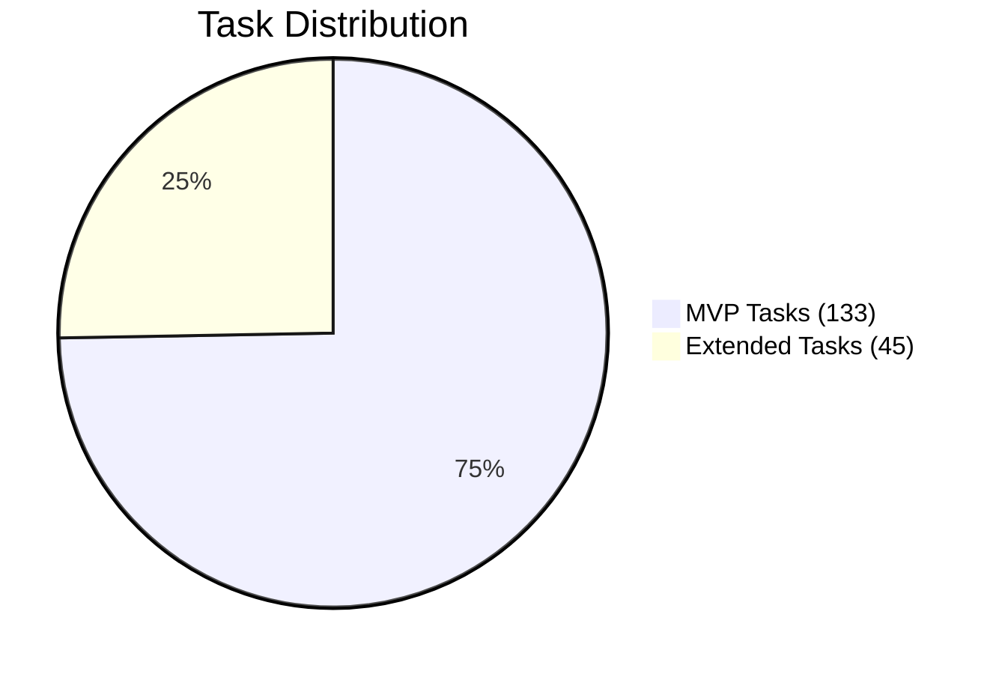
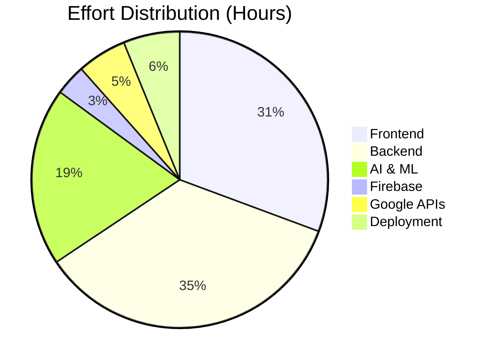

# AURA — Implementation Tasks

| Status | Version | Date |
|--------|---------|------|
| Draft | 1.0 | 2026-06-30 |

---

## Legend

| Mark | Meaning |
|------|---------|
| 🏆 **MVP** | Critical for Minimum Viable Product |
| ⏳ **Estimate** | Time in minutes (dev + test) |
| 🔗 **Depends On** | Task IDs that must be completed first |

---

## Phase 0: Foundation

_Project scaffolding, tooling, and infrastructure setup._

| ID | Category | Task | 🏆 | ⏳ | 🔗 Depends On |
|----|----------|------|----|-----|---------------|
| F-01 | Deployment | Initialize monorepo workspace with npm workspaces | 🏆 | 30 | — |
| F-02 | Deployment | Configure TypeScript (`tsconfig.base.json`) across all packages | 🏆 | 20 | F-01 |
| F-03 | Deployment | Set up ESLint + Prettier at root level | 🏆 | 20 | F-01 |
| F-04 | Deployment | Create shared types package (`shared/types/`) with core interfaces: `Task`, `User`, `Schedule`, `AgentTask`, `FocusSession`, `BehavioralData`, `WeeklyReport`, `Opportunity`, `TimelineEvent` | 🏆 | 60 | F-02 |
| F-05 | Deployment | Create shared validation package (`shared/validation/`) with Zod schemas | 🏆 | 30 | F-04 |
| F-06 | Firebase | Create Firebase project and enable Authentication | 🏆 | 15 | — |
| F-07 | Firebase | Register iOS, Android, and Web apps in Firebase Console | 🏆 | 15 | F-06 |
| F-08 | Deployment | Create GCP project and set up billing | 🏆 | 15 | — |
| F-09 | Deployment | Enable required GCP APIs: Cloud Run, Firestore, Cloud Build, Artifact Registry, Cloud Scheduler, Cloud Logging, Cloud Monitoring | 🏆 | 15 | F-08 |
| F-10 | Deployment | Write Terraform configuration for all infrastructure | 🏆 | 120 | F-08, F-09 |
| F-11 | Deployment | Set up Artifact Registry repositories for container images | 🏆 | 10 | F-10 |
| F-12 | Deployment | Create Cloud Build trigger on `main` branch push | 🏆 | 20 | F-10 |

---

## Phase 1: Firebase & Data Layer

_Firestore schema, security rules, authentication flows, and FCM._

| ID | Category | Task | 🏆 | ⏳ | 🔗 Depends On |
|----|----------|------|----|-----|---------------|
| FB-01 | Firebase | Configure Firebase Authentication with Google OAuth 2.0 provider | 🏆 | 30 | F-06 |
| FB-02 | Firebase | Define and deploy OAuth consent screen scopes: `calendar`, `calendar.events`, `drive.readonly`, `gmail.readonly` | 🏆 | 20 | FB-01 |
| FB-03 | Firebase | Implement Firebase Admin SDK initialization in shared backend package | 🏆 | 20 | F-08 |
| FB-04 | Firebase | Create Firestore database in multi-region (nam5) | 🏆 | 10 | F-09 |
| FB-05 | Firebase | Design and create Firestore indexes: `tasks` (status+priority+deadline), `tasks` (userId+status+date), `tasks` (userId+type+createdAt), `agentTasks` (targetAgent+status), `behavioralData` (userId+date) | 🏆 | 45 | FB-04 |
| FB-06 | Firebase | Write and deploy Firestore security rules (user isolation, agent service account access) | 🏆 | 45 | FB-05 |
| FB-07 | Firebase | Implement Firebase Cloud Messaging service in shared backend package (send notification to user) | 🏆 | 30 | FB-03 |

---

## Phase 2: Backend — Gateway & Orchestrator

_API Gateway, WebSocket server, Orchestrator service, and event bus._

| ID | Category | Task | 🏆 | ⏳ | 🔗 Depends On |
|----|----------|------|----|-----|---------------|
| BE-01 | Backend | Scaffold Gateway service (Fastify/Express, TypeScript, Dockerfile) | 🏆 | 30 | F-04 |
| BE-02 | Backend | Implement Firebase Auth middleware (verify ID token on every request) | 🏆 | 30 | FB-03, BE-01 |
| BE-03 | Backend | Implement rate-limiting middleware (per-UID, 100 req/min) | 🏆 | 20 | BE-01 |
| BE-04 | Backend | Implement request logging middleware (structured JSON to Cloud Logging) | 🏆 | 15 | BE-01 |
| BE-05 | Backend | Build `/health` — liveness endpoint | 🏆 | 10 | BE-01 |
| BE-06 | Backend | Build `GET /api/v1/agents/status` — agent health check endpoint | 🏆 | 20 | BE-01 |
| BE-07 | Backend | Implement WebSocket server on Gateway (`/ws`) with connection lifecycle management | 🏆 | 45 | BE-01 |
| BE-08 | Backend | Build WebSocket event emitter utility for pushing `focus:tick`, `opportunity:detected`, `schedule:updated`, `agent:status` to clients | 🏆 | 30 | BE-07 |
| BE-09 | Backend | Scaffold Orchestrator service (Dockerfile, TypeScript, Firestore client) | 🏆 | 30 | F-05 |
| BE-10 | Backend | Implement event bus reader in Orchestrator (watch `agentTasks` collection, filter by status=`queued`, claim via atomic transaction) | 🏆 | 60 | FB-05, BE-09 |
| BE-11 | Backend | Implement Orchestrator task router: map incoming events to correct agent based on event type | 🏆 | 45 | BE-10 |
| BE-12 | Backend | Implement Orchestrator watchdog: detect stale `agentTasks` (status=`in_progress` > 5 min) and mark as `failed` | 🏆 | 30 | BE-10 |
| BE-13 | Backend | Implement Orchestrator state manager: maintain coherent view of all agent states per user | 🏆 | 45 | BE-10 |
| BE-14 | Backend | Build `POST /api/v1/tasks` — create task (from Brain Dump or manual) | 🏆 | 30 | FB-03, BE-02 |
| BE-15 | Backend | Build `GET /api/v1/tasks` — list tasks with filtering (status, date, priority) | 🏆 | 25 | BE-14 |
| BE-16 | Backend | Build `GET /api/v1/tasks/:id` — get single task with failure probability | 🏆 | 15 | BE-14 |
| BE-17 | Backend | Build `PATCH /api/v1/tasks/:id` — update task fields | 🏆 | 20 | BE-14 |
| BE-18 | Backend | Build `DELETE /api/v1/tasks/:id` — soft-delete task | 🏆 | 15 | BE-14 |
| BE-19 | Backend | Build `POST /api/v1/tasks/:id/complete` — mark task complete (triggers autonomous replanning) | 🏆 | 25 | BE-14 |
| BE-20 | Backend | Build `POST /api/v1/brain-dump` — submit voice or text input, route to Gemini for parsing | 🏆 | 45 | BE-02, AI-01 |
| BE-21 | Backend | Build `POST /api/v1/brain-dump/stream` — streaming endpoint for real-time voice | 🏆 | 60 | BE-07, AI-01 |
| BE-22 | Backend | Build `GET /api/v1/brain-dump/history` — past sessions |  | 20 | BE-20 |
| BE-23 | Backend | Build `GET /api/v1/schedule` — get day/week schedule with slots | 🏆 | 30 | BE-02 |
| BE-24 | Backend | Build `POST /api/v1/schedule/replan` — trigger autonomous replanning (returns diff) | 🏆 | 30 | BE-23 |
| BE-25 | Backend | Build `POST /api/v1/schedule/optimize` — request energy-aware optimization |  | 30 | BE-23 |
| BE-26 | Backend | Build `POST /api/v1/schedule/focus-insert` — insert focus block in next available gap | 🏆 | 25 | BE-23 |
| BE-27 | Backend | Build `POST /api/v1/saveme` — trigger emergency mode (returns survival checklist, Pomodoro plan, probability) | 🏆 | 45 | BE-02 |
| BE-28 | Backend | Build `POST /api/v1/saveme/cancel` — exit emergency mode, restore schedule | 🏆 | 20 | BE-27 |
| BE-29 | Backend | Build `GET /api/v1/opportunities` — list detected opportunity slots |  | 20 | BE-02 |
| BE-30 | Backend | Build `POST /api/v1/opportunities/:id/accept` — accept micro-task suggestion |  | 15 | BE-29 |
| BE-31 | Backend | Build `POST /api/v1/opportunities/:id/dismiss` — dismiss suggestion |  | 10 | BE-29 |
| BE-32 | Backend | Build `GET /api/v1/timeline` — get timeline data (goals, achievements, milestones) with zoom levels |  | 40 | BE-02 |
| BE-33 | Backend | Build `POST /api/v1/timeline/goals` — create goal |  | 20 | BE-32 |
| BE-34 | Backend | Build `PATCH /api/v1/timeline/goals/:id` — update goal progress |  | 15 | BE-32 |
| BE-35 | Backend | Build `GET /api/v1/reports/weekly` — fetch latest weekly report |  | 15 | BE-02 |
| BE-36 | Backend | Build `GET /api/v1/reports/weekly/list` — list past reports |  | 10 | BE-35 |
| BE-37 | Backend | Build `GET /api/v1/user/profile` — get user profile | 🏆 | 15 | BE-02 |
| BE-38 | Backend | Build `PATCH /api/v1/user/profile` — update profile fields | 🏆 | 15 | BE-37 |
| BE-39 | Backend | Build `GET /api/v1/user/personality` — get AI personality settings |  | 15 | BE-02 |
| BE-40 | Backend | Build `PATCH /api/v1/user/personality` — update personality traits |  | 20 | BE-39 |
| BE-41 | Backend | Build `GET /api/v1/user/memory` — view persistent memory summary | 🏆 | 15 | BE-02 |
| BE-42 | Backend | Build `DELETE /api/v1/user/data` — full account deletion (GDPR) |  | 20 | BE-02 |

---

## Phase 3: Backend — Multi-Agent Services

_Five specialized agent services, each on independent Cloud Run._

### 3.1 Planner Agent

| ID | Category | Task | 🏆 | ⏳ | 🔗 Depends On |
|----|----------|------|----|-----|---------------|
| PA-01 | Backend | Scaffold Planner Agent service (Dockerfile, Firestore client, event bus listener) | 🏆 | 30 | F-05 |
| PA-02 | Backend | Implement schedule generation engine: produce daily plan from tasks, calendar events, and energy model | 🏆 | 90 | PA-01 |
| PA-03 | Backend | Implement Automatic Schedule Rearrangement: react to task completion/cancellation events | 🏆 | 60 | PA-02 |
| PA-04 | Backend | Implement Autonomous Replanning: end-of-day reconciliation, shift uncompleted tasks to next day | 🏆 | 60 | PA-02 |
| PA-05 | Backend | Implement Energy-Aware Scheduling: assign high-cognitive tasks to high-energy windows, admin to low-energy |  | 60 | PA-02 |
| PA-06 | Backend | Implement Focus Session Insertion: detect gaps >= 90 min, auto-block deep work | 🏆 | 45 | PA-02 |
| PA-07 | Backend | Implement Context & Location Awareness: filter tasks by physical location (home/office/gym) |  | 40 | PA-02 |
| PA-08 | Backend | Implement Smart Recurring Tasks: detect repetition patterns from user behavior, auto-create recurring tasks |  | 60 | PA-02 |
| PA-09 | Backend | Implement Opportunity Detection: scan schedule for gaps >= 15 min, generate micro-task suggestions |  | 60 | PA-02 |
| PA-10 | Backend | Implement schedule diff generation (comparison between old and new schedule for user notification) | 🏆 | 30 | PA-02 |

### 3.2 Deadline Agent

| ID | Category | Task | 🏆 | ⏳ | 🔗 Depends On |
|----|----------|------|----|-----|---------------|
| DA-01 | Backend | Scaffold Deadline Agent service (Dockerfile, Firestore client, event bus listener) | 🏆 | 30 | F-05 |
| DA-02 | Backend | Implement Failure Probability scoring engine: composite score from historical completion rate, energy level, time of day, task type, procrastination risk | 🏆 | 90 | DA-01, AI-03 |
| DA-03 | Backend | Implement Chess Engine Evaluation bar: map probability score 0-100% to visual bar with color gradient (green→yellow→red) | 🏆 | 30 | DA-02 |
| DA-04 | Backend | Implement deadline proximity monitor: periodic scan of all pending tasks approaching deadline | 🏆 | 45 | DA-02 |
| DA-05 | Backend | Implement risk escalation engine: if failure probability < 40%, notify user with proactive intervention | 🏆 | 30 | DA-04 |

### 3.3 Research Agent

| ID | Category | Task | 🏆 | ⏳ | 🔗 Depends On |
|----|----------|------|----|-----|---------------|
| RA-01 | Backend | Scaffold Research Agent service (Dockerfile, Firestore client, event bus listener) | 🏆 | 30 | F-05 |
| RA-02 | Backend | Implement meeting-aware trigger: query upcoming meetings within configurable lead time (default: 60 min before) | 🏆 | 40 | RA-01, GC-02 |
| RA-03 | Backend | Implement email thread scanner via Gmail API: find email threads related to upcoming meeting | 🏆 | 60 | RA-01, GC-04 |
| RA-04 | Backend | Implement Drive document scanner: find and fetch documents shared in meeting context | 🏆 | 45 | RA-01, GC-03 |
| RA-05 | Backend | Implement Gemini-powered brief generator: synthesize email + document content into 3-paragraph executive summary | 🏆 | 60 | RA-03, RA-04, AI-01 |
| RA-06 | Backend | Implement briefing delivery via FCM and in-app notification | 🏆 | 20 | RA-05, FB-07 |

### 3.4 Reflection Agent

| ID | Category | Task | 🏆 | ⏳ | 🔗 Depends On |
|----|----------|------|----|-----|---------------|
| RF-01 | Backend | Scaffold Reflection Agent service (Dockerfile, Firestore client, event bus listener) |  | 30 | F-05 |
| RF-02 | Backend | Implement end-of-day analysis pipeline: aggregate completed tasks, focus sessions, behavioral data |  | 60 | RF-01 |
| RF-03 | Backend | Implement habit tracking: detect streaks and regressions from task completion patterns |  | 45 | RF-02 |
| RF-04 | Backend | Implement energy curve computation: derive energy peaks/troughs from behavioral data |  | 45 | RF-02 |
| RF-05 | Backend | Implement procrastination risk factor calculation from app usage and task delay patterns |  | 40 | RF-02 |
| RF-06 | Backend | Implement Time & Effort Estimation model updater: recalibrate per-task-type speed factors |  | 45 | RF-02, AI-03 |
| RF-07 | Backend | Implement Persistent Memory updater: cross-session context, preferences, recurring patterns | 🏆 | 30 | RF-02 |
| RF-08 | Backend | Implement Weekly Premium Report generator: compute weekly aggregates, call Gemini for narrative, write to Firestore |  | 90 | RF-02, RF-03, RF-04, RF-05 |
| RF-09 | Backend | Implement weekly report delivery via FCM push + in-app notification |  | 15 | RF-08, FB-07 |

### 3.5 Focus Agent

| ID | Category | Task | 🏆 | ⏳ | 🔗 Depends On |
|----|----------|------|----|-----|---------------|
| FA-01 | Backend | Scaffold Focus Agent service (Dockerfile, Firestore client, event bus listener) | 🏆 | 30 | F-05 |
| FA-02 | Backend | Implement Pomodoro cycle manager: 25 min focus / 5 min break, configurable cycles | 🏆 | 60 | FA-01 |
| FA-03 | Backend | Implement real-time timer sync via WebSocket (push `focus:tick` events every second) | 🏆 | 30 | FA-02, BE-07 |
| FA-04 | Backend | Implement notification suppression during focus blocks (coordinate with device-side FCM) | 🏆 | 30 | FA-02 |
| FA-05 | Backend | Implement Save Me handler: generate Pomodoro-based survival plan from compressed schedule | 🏆 | 45 | FA-02, PA-10, DA-02 |
| FA-06 | Backend | Implement focus session outcome reporter: log completion/abandonment/interruption to Firestore | 🏆 | 20 | FA-02 |
| FA-07 | Backend | Implement break reminder: push notification at end of each Pomodoro cycle | 🏆 | 15 | FA-02, FB-07 |

---

## Phase 4: AI & Machine Learning

_Gemini API integration, Vertex AI model training and serving, behavioral engine._

| ID | Category | Task | 🏆 | ⏳ | 🔗 Depends On |
|----|----------|------|----|-----|---------------|
| AI-01 | AI | Implement Gemini API client in shared backend package: text generation, streaming, structured output parsing | 🏆 | 60 | F-09 |
| AI-02 | AI | Implement Brain Dump parser: send raw transcript to Gemini, receive structured `{ tasks[], deadlines, priorities, context }` | 🏆 | 60 | AI-01 |
| AI-03 | AI | Implement document summarizer: PDF/Doc → executive summary via Gemini | 🏆 | 40 | AI-01 |
| AI-04 | AI | Implement natural language schedule reasoning: current schedule + task queue → optimized schedule via Gemini | 🏆 | 60 | AI-01 |
| AI-05 | AI | Implement personality-aware response generator: user query + user's personality profile → personalized Gemini prompt |  | 45 | AI-01 |
| AI-06 | AI | Implement weekly report narrative generator: aggregated data → natural language insights via Gemini |  | 45 | AI-01 |
| AI-07 | AI | Implement voice activity detection (VAD) + speech-to-text pipeline via Gemini API | 🏆 | 60 | AI-01 |
| AI-08 | AI | Set up Vertex AI Workbench for model development |  | 45 | F-09 |
| AI-09 | AI | Develop and train Time & Effort Estimation regression model on Vertex AI: predict task duration from historical completion data |  | 180 | AI-08 |
| AI-10 | AI | Develop and train Failure Probability classifier on Vertex AI: binary classification (will-fail / will-succeed) from task features + behavioral data |  | 180 | AI-08 |
| AI-11 | AI | Develop and train Energy Curve model on Vertex AI: predict user energy level by hour of day |  | 120 | AI-08 |
| AI-12 | AI | Develop Opportunity Ranker: score micro-task suggestions by context fit (location, energy, time-of-day, pending tasks) |  | 90 | AI-08 |
| AI-13 | AI | Deploy all Vertex AI models to prediction endpoints |  | 60 | AI-09, AI-10, AI-11 |
| AI-14 | AI | Implement behavioral engine data pipeline: collect device usage (screen time, app categories, sleep), transform and store in Firestore | 🏆 | 60 | F-04 |
| AI-15 | AI | Implement daily incremental model retraining trigger (Vertex AI scheduled training) |  | 45 | AI-13 |
| AI-16 | AI | Implement weekly full model retraining pipeline (Vertex AI scheduled training) |  | 60 | AI-13 |

---

## Phase 5: Google API Integrations

_Calendar, Drive, Gmail SDK clients and OAuth token management._

| ID | Category | Task | 🏆 | ⏳ | 🔗 Depends On |
|----|----------|------|----|-----|---------------|
| GC-01 | Google APIs | Implement Google OAuth 2.0 token exchange and refresh utility in shared backend package | 🏆 | 45 | FB-01, FB-03 |
| GC-02 | Google APIs | Implement Google Calendar API client: list calendars, query busy time, create/update/delete events, watch for changes | 🏆 | 90 | GC-01 |
| GC-03 | Google APIs | Implement Google Drive API client: list files, read file content, search by query |  | 60 | GC-01 |
| GC-04 | Google APIs | Implement Gmail API client: list threads, get thread details, search by query, extract attachments |  | 60 | GC-01 |
| GC-05 | Google APIs | Implement OAuth scope verification endpoint: check all required scopes are still granted, prompt re-auth if revoked | 🏆 | 20 | GC-01 |
| GC-06 | Google APIs | Implement calendar change webhook handler: detect external calendar changes and trigger Planner Agent recalculation | 🏆 | 45 | GC-02, PA-03 |

---

## Phase 6: Frontend — Mobile (React Native)

_Mobile app for iOS and Android with voice input, FCM, and full feature surface._

| ID | Category | Task | 🏆 | ⏳ | 🔗 Depends On |
|----|----------|------|----|-----|---------------|
| FE-01 | Frontend | Scaffold React Native project with TypeScript, navigation framework, state management | 🏆 | 60 | F-04 |
| FE-02 | Frontend | Integrate Firebase Authentication SDK (Google Sign-In) with OAuth scopes for Calendar, Drive, Gmail | 🏆 | 60 | FB-01, FE-01 |
| FE-03 | Frontend | Build onboarding flow: sign-in, permission grant, first voice intro | 🏆 | 90 | FE-02 |
| FE-04 | Frontend | Build API client module: HTTP + WebSocket connections to Gateway | 🏆 | 45 | BE-01, FE-01 |
| FE-05 | Frontend | Implement voice capture UI: mic button, audio level indicator, recording state management | 🏆 | 60 | FE-01 |
| FE-06 | Frontend | Implement Brain Dump screen: press mic, speak, see live transcription, confirmation of parsed tasks | 🏆 | 90 | FE-04, FE-05, BE-20 |
| FE-07 | Frontend | Build task list screen: filterable, sortable, swipe-to-complete, failure probability bar visualization | 🏆 | 90 | FE-04, BE-15 |
| FE-08 | Frontend | Build schedule view (day/week): timeline with event blocks, focus session highlights, conflict indicators | 🏆 | 120 | FE-04, BE-23 |
| FE-09 | Frontend | Implement schedule diff display: visual diff when AURA replans (green=new, red=removed, yellow=shifted) | 🏆 | 45 | FE-08, PA-10 |
| FE-10 | Frontend | Build Save Me screen: emergency button, survival checklist with checkboxes, Pomodoro countdown timer | 🏆 | 90 | FE-04, BE-27 |
| FE-11 | Frontend | Build Focus/Pomodoro screen: countdown timer, cycle counter, break overlay, interruption logging | 🏆 | 75 | FE-04, BE-26 |
| FE-12 | Frontend | Build Opportunity Detection card: slide-up suggestion panel with micro-task options |  | 60 | FE-04, BE-29 |
| FE-13 | Frontend | Build Life Timeline screen: horizontal scrollable timeline with zoom levels, goal hierarchy tree |  | 120 | FE-04, BE-32 |
| FE-14 | Frontend | Build Weekly Premium Report screen: formatted report card with charts, streaks, insights |  | 90 | FE-04, BE-35 |
| FE-15 | Frontend | Build Settings screen: personality sliders (directness, empathy, humour, challenge level), data management, logout |  | 60 | FE-02, BE-39 |
| FE-16 | Frontend | Implement persistent memory display: show what AURA remembers about the user | 🏆 | 30 | FE-04, BE-41 |
| FE-17 | Frontend | Integrate Firebase Cloud Messaging: register device token, handle foreground/background push notifications | 🏆 | 45 | FB-07, FE-01 |
| FE-18 | Frontend | Build notification handlers: display daily briefing, proactive alerts, focus timer, Save Me confirmations | 🏆 | 45 | FE-17 |

---

## Phase 7: Frontend — Web (React PWA)

_Desktop companion with same feature set. Reuses shared types and API client logic._

| ID | Category | Task | 🏆 | ⏳ | 🔗 Depends On |
|----|----------|------|----|-----|---------------|
| FW-01 | Frontend | Scaffold React PWA project with TypeScript, routing |  | 45 | F-04 |
| FW-02 | Frontend | Build shared UI component library (used by both mobile and web where applicable) |  | 60 | FE-01, FW-01 |
| FW-03 | Frontend | Implement web-based Firebase Authentication with Google Sign-In |  | 45 | FB-01, FW-01 |
| FW-04 | Frontend | Build web onboarding flow |  | 60 | FW-03 |
| FW-05 | Frontend | Build web Brain Dump screen (text-first, mic as fallback) |  | 60 | FW-01, BE-20 |
| FW-06 | Frontend | Build web task list and schedule views |  | 90 | FW-01, FE-07, FE-08 |
| FW-07 | Frontend | Build web Save Me, Focus, and Timeline screens |  | 120 | FW-01, FE-10, FE-11, FE-13 |
| FW-08 | Frontend | Build web Settings and Weekly Report views |  | 60 | FW-01, FE-14, FE-15 |
| FW-09 | Frontend | Implement FCM in web via Firebase Cloud Messaging Web SDK |  | 30 | FB-07, FW-01 |
| FW-10 | Frontend | Implement PWA manifest, service worker, offline fallback page |  | 45 | FW-01 |

---

## Phase 8: Integration & Testing

_End-to-end testing, integration testing, load testing, and quality assurance._

| ID | Category | Task | 🏆 | ⏳ | 🔗 Depends On |
|----|----------|------|----|-----|---------------|
| T-01 | Deployment | Write unit tests for shared types and validation schemas | 🏆 | 30 | F-05 |
| T-02 | Deployment | Write unit tests for Gateway middleware (auth, rate-limit, logging) | 🏆 | 45 | BE-02, BE-03, BE-04 |
| T-03 | Deployment | Write unit tests for each agent's core logic module | 🏆 | 120 | PA-02, DA-02, FA-02, RA-02, RF-02 |
| T-04 | Deployment | Write integration tests for event bus (agentTasks collection) | 🏆 | 60 | BE-10 |
| T-05 | Deployment | Write end-to-end test: Brain Dump → task creation → scheduling → user notification | 🏆 | 60 | BE-20, PA-02, DA-02 |
| T-06 | Deployment | Write end-to-end test: Save Me → compression → Pomodoro → completion | 🏆 | 60 | BE-27, FA-05 |
| T-07 | Deployment | Write end-to-end test: Opportunity Detection → accept → task added |  | 45 | PA-09, BE-29, BE-30 |
| T-08 | Deployment | Write end-to-end test: Meeting → Research Agent → brief generation → delivery |  | 60 | RA-05, RA-06 |
| T-09 | Deployment | Write end-to-end test: End-of-day → Reflection → Weekly Report |  | 60 | RF-08, RF-09 |
| T-10 | Deployment | Write integration tests for each Google API client (Calendar, Drive, Gmail) with mock responses | 🏆 | 60 | GC-02, GC-03, GC-04 |
| T-11 | Deployment | Write integration tests for Gemini API interaction with mock responses | 🏆 | 45 | AI-02, AI-03 |
| T-12 | Deployment | Write integration tests for FCM notification delivery | 🏆 | 30 | FB-07 |
| T-13 | Deployment | Load test: 1000 concurrent users, Gateway + Orchestrator + all 5 agents |  | 120 | T-05 |
| T-14 | Deployment | Load test: Vertex AI model endpoint throughput and latency |  | 60 | AI-13 |
| T-15 | Deployment | Security audit: Firestore rules, IAM roles, OAuth scope validation | 🏆 | 60 | FB-06, GC-05 |

---

## Phase 9: Deployment & Production Readiness

_Production deployment, monitoring, alerting, and operational excellence._

| ID | Category | Task | 🏆 | ⏳ | 🔗 Depends On |
|----|----------|------|----|-----|---------------|
| D-01 | Deployment | Build and push all Docker images to Artifact Registry | 🏆 | 30 | All BE + PA + DA + RA + RF + FA tasks |
| D-02 | Deployment | Deploy Gateway service to Cloud Run with min=2, max=50 instances | 🏆 | 20 | D-01, F-10 |
| D-03 | Deployment | Deploy Orchestrator service to Cloud Run with min=2, max=20 instances | 🏆 | 20 | D-01 |
| D-04 | Deployment | Deploy all 5 agent services to Cloud Run with per-service instance limits | 🏆 | 20 | D-01 |
| D-05 | Deployment | Configure Cloud Run IAM: service accounts with least-privilege roles | 🏆 | 30 | D-02...D-04 |
| D-06 | Deployment | Configure Cloud Load Balancer + Cloud CDN + Cloud DNS (`api.aura.app`) | 🏆 | 45 | D-02 |
| D-07 | Deployment | Configure Cloud Scheduler jobs: end-of-day (23:00), weekly report (Sun 20:00), model retrain (Sun 02:00), data cleanup (1st of month 03:00) |  | 30 | D-03 |
| D-08 | Deployment | Set up Cloud Logging metrics + log-based alerts for: error rate > 1%, P95 latency > 2s, agent task failure rate > 5% | 🏆 | 45 | D-02...D-04 |
| D-09 | Deployment | Set up Cloud Monitoring dashboards: per-service CPU/memory, request count, latency, concurrent connections | 🏆 | 45 | D-02...D-04 |
| D-10 | Deployment | Configure uptime checks on `/health` endpoint for all 7 services with 5-min interval | 🏆 | 20 | D-02...D-04 |
| D-11 | Deployment | Set up notification channels: email + Slack webhook for P1 alerts | 🏆 | 15 | D-08 |
| D-12 | Deployment | Configure Secret Manager: Gemini API key, Firebase service account keys | 🏆 | 30 | D-02...D-04 |
| D-13 | Deployment | Enable Firestore daily backups with 7-day retention | 🏆 | 15 | FB-04 |
| D-14 | Deployment | Run full smoke test suite against production deployment | 🏆 | 30 | T-05...T-09 |
| D-15 | Deployment | Write runbooks: incident response, deployment rollback, data recovery |  | 60 | D-14 |

---

## Summary

### Total Effort

| Phase | Tasks | MVP Tasks | MVP Minutes | Total Minutes |
|-------|-------|-----------|-------------|---------------|
| Phase 0: Foundation | 12 | 12 | 370 | 370 |
| Phase 1: Firebase & Data | 7 | 7 | 200 | 200 |
| Phase 2: Backend — Gateway & Orchestrator | 42 | 29 | 745 | 1,020 |
| Phase 3.1: Planner Agent | 10 | 7 | 345 | 525 |
| Phase 3.2: Deadline Agent | 5 | 5 | 225 | 225 |
| Phase 3.3: Research Agent | 6 | 6 | 255 | 255 |
| Phase 3.4: Reflection Agent | 9 | 1 | 30 | 400 |
| Phase 3.5: Focus Agent | 7 | 7 | 230 | 230 |
| Phase 4: AI & ML | 16 | 7 | 385 | 1,150 |
| Phase 5: Google APIs | 6 | 5 | 260 | 320 |
| Phase 6: Frontend — Mobile | 18 | 17 | 1,125 | 1,200 |
| Phase 7: Frontend — Web | 10 | 4 | 210 | 615 |
| Phase 8: Integration & Testing | 15 | 12 | 675 | 900 |
| Phase 9: Deployment | 15 | 14 | 395 | 425 |
| **Total** | **178** | **133** | **5,450** | **7,835** |

### MVP vs Extended





### MVP Timeline Estimate

- **133 MVP tasks** × ~41 min average = **~5,450 minutes (~91 hours)** for a single developer
- With a team of 3 developers working in parallel (respecting dependency chains): **~4–5 weeks**
- Critical path: Foundation → Backend Core → Agents → AI → Frontend → Integration

### Key Dependency Chain

```
F-01 → F-04 → BE-01 → BE-09 → BE-10 → PA-01 → PA-02 (Planner Agent)
                                    → DA-01 → DA-02 (Deadline Agent)
                                    → RA-01 → RA-02 (Research Agent)
                                    → FA-01 → FA-02 (Focus Agent)

F-06 → FB-01 → GC-01 → GC-02 (Calendar)
                      → GC-03 (Drive)
                      → GC-04 (Gmail)

F-09 → AI-01 → AI-02 (Brain Dump parsing)
             → AI-03 (Summarization)

FB-03 → FE-01 → FE-02 → FE-06 (Brain Dump screen)
                       → FE-07 (Task list)
                       → FE-08 (Schedule view)
                       → FE-10 (Save Me screen)
```

---

*End of Tasks Document*
